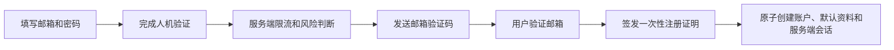
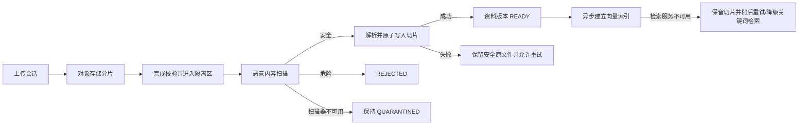
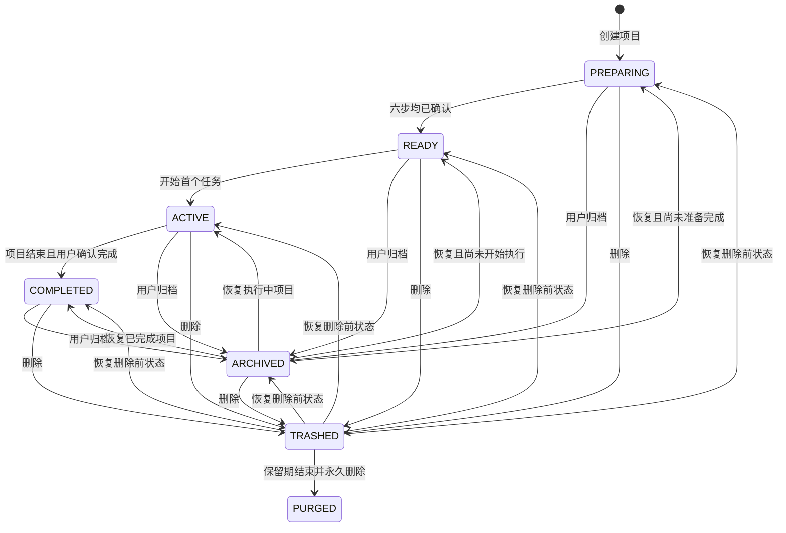
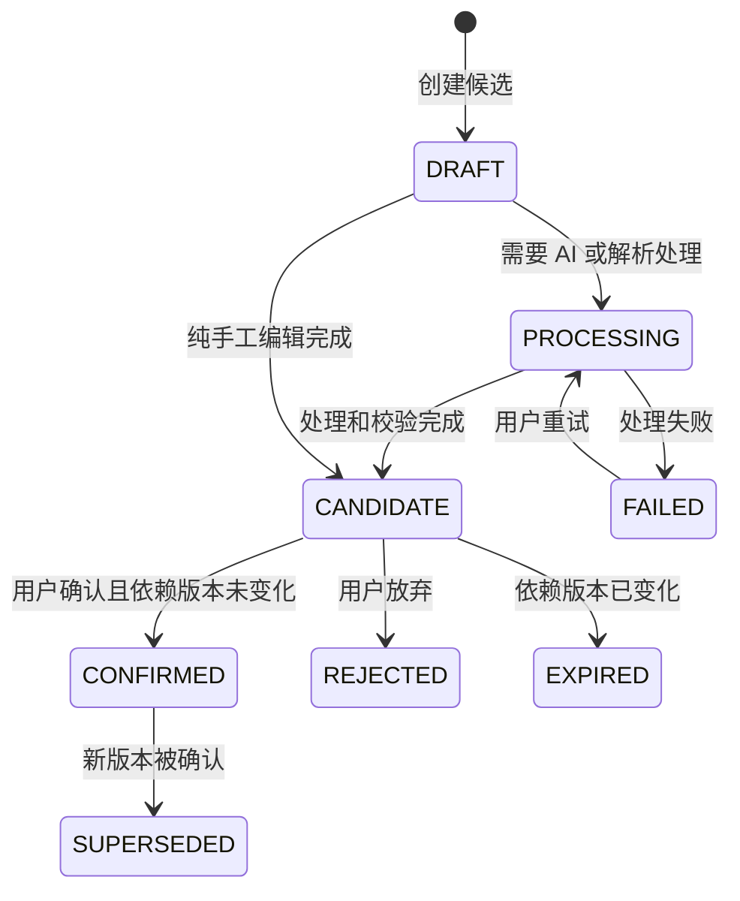
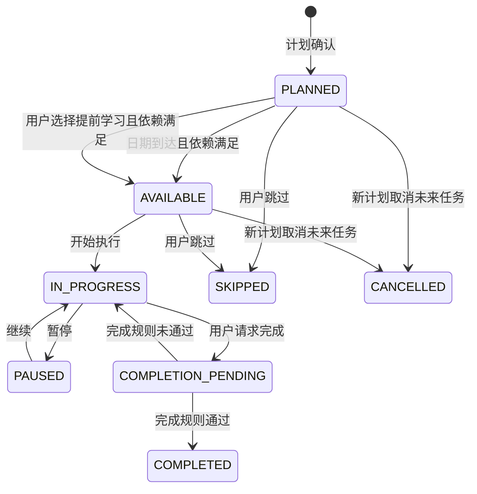
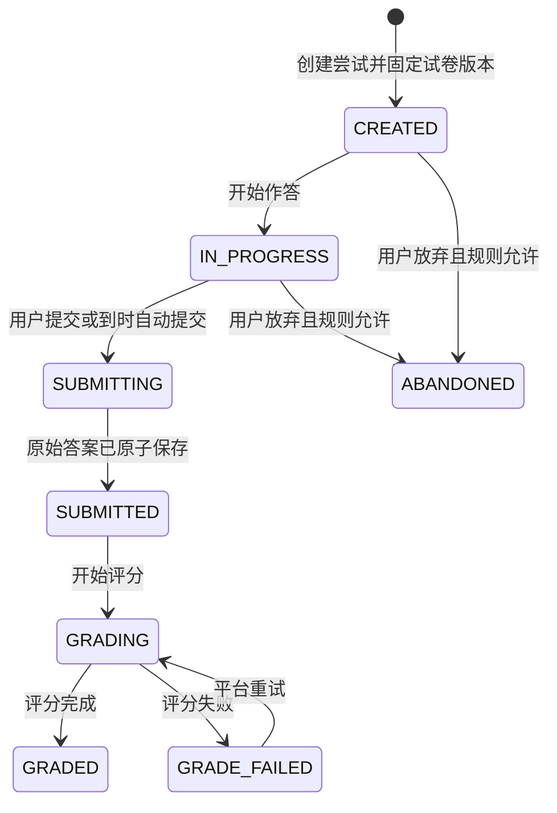
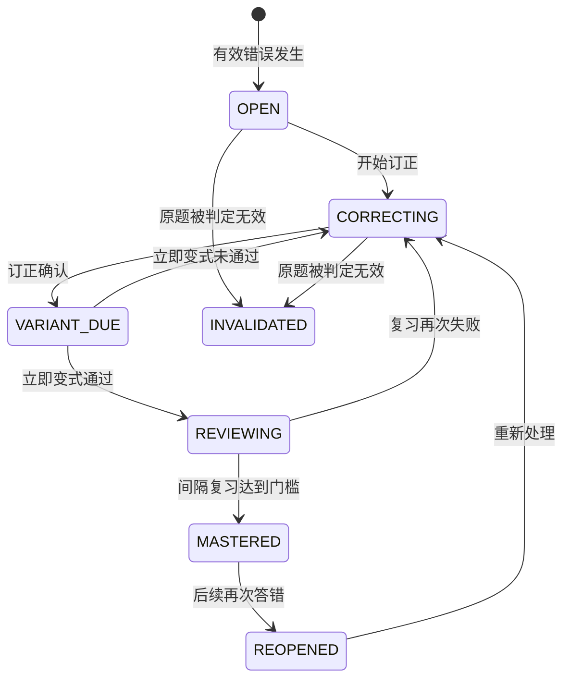
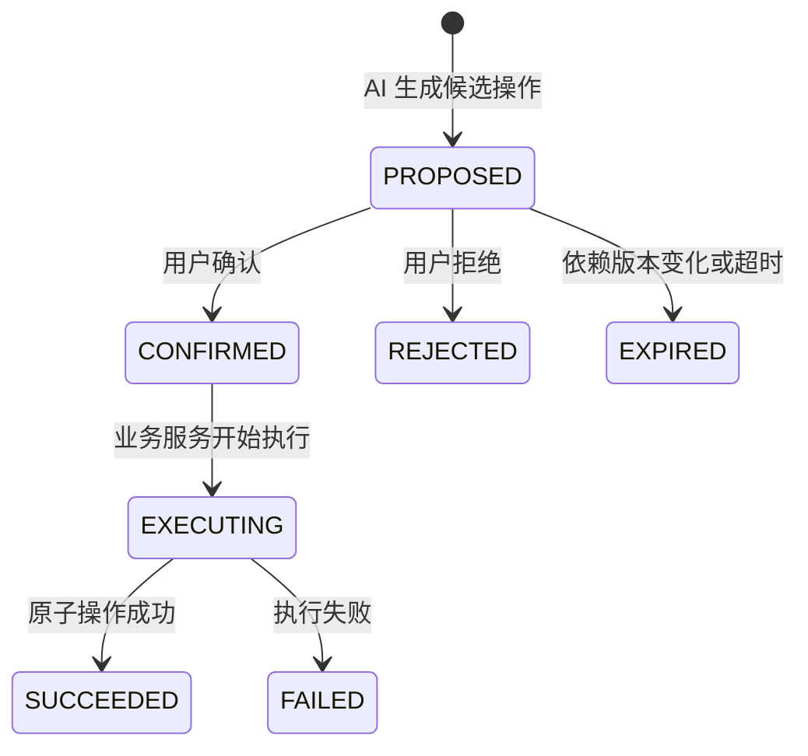
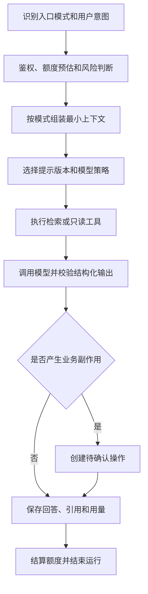

# ExamInsight V2 API 契约与状态机

> 状态：前后端契约冻结稿  
> API 前缀：`/api/v2`  
> 本文定义行为和边界，不等同于当前 Controller 实现。字段、外键和索引见 [PHYSICAL_SCHEMA.md](./PHYSICAL_SCHEMA.md)。

## 1. 契约原则

1. Controller 只做认证、DTO 校验、调用应用服务和响应映射，不承载计划生成、评分或 JSON 拼装业务。
2. 所有接口使用明确的 Request/Response DTO，禁止使用 `Map<String, Object>` 作为核心请求或响应。
3. URL 使用外部 ULID；数据库内部 ID 不暴露。
4. 客户端不能直接写任务、生成任务、解析任务或评分任务的状态和进度。
5. 高影响 AI 建议必须先建立 `pending_action`，再由确认接口执行。
6. 异步工作统一返回 `jobId`，使用查询和 SSE 获取服务端状态。
7. 所有资源读取必须在服务端完成所有权或授权判断。
8. 业务错误返回稳定错误码，不向用户暴露 SQL、供应商堆栈、原始提示词和密钥。

## 2. 通用 HTTP 约定

### 2.1 响应

成功响应直接返回类型化业务对象：

```json
{
  "id": "01K...",
  "name": "数据结构期末冲刺",
  "status": "PREPARING",
  "version": 3
}
```

错误响应：

```json
{
  "error": {
    "code": "VERSION_CONFLICT",
    "message": "内容已在其他页面更新，请刷新后重试。",
    "requestId": "01K...",
    "details": {}
  }
}
```

`details` 只能包含客户端可安全处理的字段错误、冲突摘要和建议操作。

### 2.2 状态码

| HTTP | 使用场景 |
|---|---|
| `200` | 查询或更新成功 |
| `201` | 同步创建成功 |
| `202` | 异步任务已接受 |
| `204` | 无正文删除/撤销成功 |
| `400` | DTO 或业务参数非法 |
| `401` | 未登录或会话失效 |
| `403` | 权限、能力、额度或二次验证不足 |
| `404` | 对象不存在或用户无权知道其存在 |
| `409` | 版本、状态、重复操作或幂等冲突 |
| `413` | 文件或请求过大 |
| `422` | 请求结构合法但无法满足业务约束 |
| `429` | 用户/IP/设备/全局限流 |
| `503` | 必需依赖不可用且没有安全降级 |

### 2.3 幂等与乐观锁

- 创建、确认、提交、重试、取消和删除接口要求 `Idempotency-Key`。
- 更新响应返回 `ETag: "<row_version>"`。
- 修改现有对象要求 `If-Match`；不匹配返回 `409 VERSION_CONFLICT`。
- 相同幂等键和相同请求摘要返回第一次结果；相同键不同请求返回 `409 IDEMPOTENCY_MISMATCH`。

### 2.4 分页

使用游标分页：

```json
{
  "items": [],
  "nextCursor": "opaque-cursor-or-null",
  "hasMore": false
}
```

不使用会随新增数据漂移的页码分页处理消息、事件、错题和任务历史。

## 3. 前端路由

```text
/chat/new                                  新对话首页
/chat/:conversationId                     普通对话
/learning                                 智能学习首页
/learning/projects                        项目列表
/learning/projects/new                    创建项目入口
/learning/projects/:projectId/setup       项目准备页
/learning/projects/:projectId/overview    项目总览
/learning/projects/:projectId/today       今日学习
/learning/projects/:projectId/tasks/:id   任务执行
/learning/projects/:projectId/plan        学习计划
/learning/projects/:projectId/resources   学习资源
/learning/projects/:projectId/wrongbook   错题本
/learning/projects/:projectId/assistant   学习助教
/learning/projects/:projectId/settings    项目设置
/assessments/:assessmentId/attempt        测评作答
/attempts/:attemptId/result               测评结果
/library                                  个人资料库
/knowledge-bases/:knowledgeBaseId         知识库
```

旧路由只允许在切换窗口进行明确重定向，不能长期维护两套页面行为。

## 4. 注册、登录与会话 API

```text
POST   /auth/registration-challenges
POST   /auth/registration-challenges/{id}/verify-email
POST   /auth/register
POST   /auth/login
POST   /auth/login-challenges/{id}/verify-email
POST   /auth/logout
POST   /auth/logout-all
GET    /auth/session
POST   /auth/password-reset-requests
POST   /auth/password-resets
GET    /auth/csrf
```

### 4.1 注册流程



规则：

- 验证码发送前执行邮箱、IP、设备和全局限流，滑块本身不是唯一防线。
- 邮件验证码用于验证邮箱所有权；滑块/无感验证用于降低自动化滥用，两者职责不同。
- 验证邮箱成功后返回默认 10 分钟有效的一次性高熵注册证明，数据库只保存摘要；`POST /auth/register` 必须消费该证明，不能把公开的挑战 ID 当作注册凭据。
- 尚未验证的邮箱不会预先创建 `app_user`；正常公开注册创建的账户直接进入 `ACTIVE`。
- 登录风险较高时返回 `STEP_UP_REQUIRED` 和挑战 ID，不直接创建完整会话。
- 登录失败响应不暴露邮箱是否存在。
- 邮箱验证码默认 6 位、10 分钟有效、最多尝试 5 次、重发冷却 60 秒；密码重置使用 32 字节随机邮件链接，30 分钟有效。
- 普通用户 Session 默认 24 小时无活动过期、30 天绝对过期、每 24 小时轮换；高风险操作要求最近 10 分钟内重新验证。
- 全部退出、修改密码和密码重置必须递增账户 `session_version` 并撤销已有 Session；单个 Session 的 `token_version` 只用于该 Session 的令牌轮换。
- 人机验证、邮件服务或共享限流不可用时暂停发送新验证码和重置邮件，不允许绕过；已有有效 Session 不受邮件服务故障影响。
- 完整限流、管理员 Session 和密码参数以 [PHYSICAL_SCHEMA.md 第 22 节](./PHYSICAL_SCHEMA.md#22-公开-beta-部署参数) 为准。

## 5. 资料与知识库 API

```text
POST   /uploads
PUT    /uploads/{uploadId}/parts/{partNo}
POST   /uploads/{uploadId}/complete
DELETE /uploads/{uploadId}

GET    /assets
POST   /assets
GET    /assets/{assetId}
PATCH  /assets/{assetId}
POST   /assets/{assetId}/versions
POST   /assets/{assetId}/versions/{versionId}/activate
DELETE /assets/{assetId}
POST   /assets/{assetId}/restore
GET    /assets/{assetId}/preview
GET    /assets/{assetId}/download

GET    /knowledge-bases
POST   /knowledge-bases
GET    /knowledge-bases/{knowledgeBaseId}
PATCH  /knowledge-bases/{knowledgeBaseId}
DELETE /knowledge-bases/{knowledgeBaseId}
POST   /knowledge-bases/{knowledgeBaseId}/restore
POST   /knowledge-bases/{knowledgeBaseId}/assets
PUT    /knowledge-bases/{knowledgeBaseId}/assets/order
DELETE /knowledge-bases/{knowledgeBaseId}/assets/{assetId}
```

上传完成后返回资料、隔离版本和安全处理任务；安全扫描通过后才创建解析任务：

```json
{
  "asset": { "id": "01K...", "name": "讲义.pdf" },
  "version": { "id": "01K...", "status": "QUARANTINED" },
  "job": { "id": "01K...", "status": "QUEUED" }
}
```

公开 Beta 上传白名单为 PDF、DOCX、PPTX、XLSX、TXT、MD、CSV、JPG、JPEG、PNG、WebP；文档上限 100 MB、图片 20 MB、文本 10 MB，单批最多 10 个/500 MB，8 MiB 分片。类型、魔数、压缩结构或恶意内容校验失败返回明确安全错误；扫描服务不可用时保持隔离状态，不返回伪成功。

`POST /uploads/{uploadId}/complete` 按上传会话幂等：同一个会话只创建一个资料版本，网络重试返回首次完成的结果。客户端不能直接写 `uploadedBytes`、MIME、哈希或处理状态，服务端以对象存储回执和实际检测结果为准。



知识库名称由服务端规范化，客户端只提交展示名称。`DELETE /knowledge-bases/{id}` 进入回收站并保留资料关联；恢复时若规范化名称已被新知识库占用，返回 `KNOWLEDGE_BASE_NAME_CONFLICT`，不得自动改名。归档知识库只读；只有 `ACTIVE` 知识库允许增加、移除或排序资料。

添加资料时，服务端验证知识库和资料均属于当前用户且资料为可加入状态，数据库组合外键再次强制同一所有者。同一资料重复加入按现有关联幂等返回。资料被归档或放入回收站后关系仍保留，详情页显示对应状态；检索不得读取 `TRASHED/PURGED` 资料。

从知识库移除资料只解除关联；永久删除知识库只级联删除关联，不删除资料、资料版本、解析结果或向量。知识库读取资料当前可用版本；从项目移除资料只影响新的学习依据候选，资料永久删除必须经过回收站和依赖检查。

## 6. 对话与 AI API

```text
GET    /capabilities
POST   /conversations
GET    /conversations
GET    /conversations/{conversationId}
PATCH  /conversations/{conversationId}
DELETE /conversations/{conversationId}
POST   /conversations/{conversationId}/messages
POST   /messages/{messageId}/edits
POST   /messages/{messageId}/regenerations
POST   /conversations/{conversationId}/branches/{branchId}/activate
GET    /ai-runs/{runId}
POST   /ai-runs/{runId}/cancel
GET    /ai-runs/{runId}/events
GET    /pending-actions/{actionId}
POST   /pending-actions/{actionId}/confirm
POST   /pending-actions/{actionId}/reject
```

发送消息返回 `202`：

```json
{
  "userMessageId": "01K...",
  "assistantMessageId": "01K...",
  "runId": "01K...",
  "eventUrl": "/api/v2/ai-runs/01K.../events"
}
```

SSE 事件最小集合：

```text
run.accepted
run.stage_changed
message.delta
tool.started
tool.completed
pending_action.created
usage.updated
run.completed
run.failed
run.cancelled
```

断线重连通过 `Last-Event-ID` 恢复；最终消息和任务状态始终从 MySQL 查询，SSE 不是事实来源。

## 7. 学习项目 API

### 7.1 项目根

```text
GET    /learning-projects
POST   /learning-projects
GET    /learning-projects/{projectId}
PATCH  /learning-projects/{projectId}
DELETE /learning-projects/{projectId}
POST   /learning-projects/{projectId}/restore
GET    /learning-projects/{projectId}/setup-summary
```

创建请求只包含：

```json
{
  "name": "数据结构期末冲刺",
  "iconKey": "book-open",
  "iconColor": "indigo",
  "baseKnowledgeBaseId": "01K...",
  "entryIntent": "CREATE_PLAN"
}
```

`baseKnowledgeBaseId`、`entryIntent` 可为空。入口意图只影响准备页提示，不改变唯一工作流。

### 7.2 项目状态机



归档只隐藏在默认项目列表，不删除计划、资料、资源、作答和错题。进入回收站时记录 `previous_status`，恢复只能回到删除前状态，不能由客户端任选状态。

## 8. 准备流程 API

### 8.1 考试目标

```text
GET    /learning-projects/{projectId}/exam-target
POST   /learning-projects/{projectId}/exam-target-candidates
PATCH  /exam-target-candidates/{versionId}
POST   /exam-target-candidates/{versionId}/confirm
POST   /exam-target-candidates/{versionId}/reject
```

目标候选包含考试日期、目标、时区、每周可用时间、不可学习日期和风险提示。确认新目标不会自动覆盖现行计划，只会标记“需要分析是否重排”。

### 8.2 学习依据

```text
GET    /learning-projects/{projectId}/source-sets/current
POST   /learning-projects/{projectId}/source-set-candidates
POST   /source-set-candidates/{sourceSetId}/items
DELETE /source-set-candidates/{sourceSetId}/items/{itemId}
GET    /source-set-candidates/{sourceSetId}/readiness
POST   /source-set-candidates/{sourceSetId}/confirm
POST   /source-set-candidates/{sourceSetId}/reject
```

只有所有必选资料已经解析成功或用户明确排除失败资料时，才能确认依据。确认操作锁定每个 `assetVersionId` 和 `parseResultId`。

### 8.3 考试范围

```text
GET    /learning-projects/{projectId}/scopes/current
POST   /learning-projects/{projectId}/scope-generation-jobs
GET    /scope-versions/{scopeVersionId}
PATCH  /scope-versions/{scopeVersionId}/nodes/{nodeId}
POST   /scope-versions/{scopeVersionId}/nodes
DELETE /scope-versions/{scopeVersionId}/nodes/{nodeId}
POST   /scope-versions/{scopeVersionId}/conflicts/{conflictId}/resolve
POST   /scope-versions/{scopeVersionId}/confirm
POST   /scope-versions/{scopeVersionId}/reject
```

范围节点接口返回引用、置信度和冲突状态。存在未处理的阻断级冲突时不得确认。

### 8.4 诊断

```text
POST   /learning-projects/{projectId}/diagnostic-generation-jobs
GET    /learning-projects/{projectId}/diagnostics/current
POST   /learning-projects/{projectId}/diagnostics/skip
POST   /assessments/{assessmentId}/attempts
PUT    /attempts/{attemptId}/responses/{itemId}
POST   /attempts/{attemptId}/submit
GET    /attempts/{attemptId}/result
```

跳过诊断是显式业务操作，记录原因和时间；不能通过“没有诊断记录”推断为已跳过。

### 8.5 准备版本通用状态机

考试目标、学习依据、考试范围和资源配置都遵循“候选后确认”，不能直接覆盖当前版本：



资料解析状态属于 `asset_version/asset_parse_result`，不应混进 `project_source_set` 的确认状态。

### 8.6 差距分析与计划

```text
POST   /learning-projects/{projectId}/gap-analysis-jobs
GET    /learning-projects/{projectId}/gap-analyses/current
POST   /learning-projects/{projectId}/plan-generation-jobs
GET    /learning-projects/{projectId}/plans/current
GET    /learning-projects/{projectId}/plan-candidates/{versionId}
PATCH  /plan-candidates/{versionId}/tasks/{taskId}
POST   /plan-candidates/{versionId}/ai-revision-jobs
GET    /plan-candidates/{versionId}/diff
POST   /plan-candidates/{versionId}/confirm
POST   /plan-candidates/{versionId}/reject
POST   /learning-projects/{projectId}/replan-jobs
```

任何重排都创建候选版本。确认接口必须再次校验考试日期、时间预算、任务依赖以及用户当前执行状态。

### 8.7 资源配置与生成

```text
GET    /learning-projects/{projectId}/resource-requirements
POST   /learning-projects/{projectId}/resource-config-candidates
PATCH  /resource-config-candidates/{versionId}
POST   /resource-config-candidates/{versionId}/estimate
POST   /resource-config-candidates/{versionId}/confirm
POST   /learning-projects/{projectId}/generation-batches
GET    /generation-batches/{batchId}
POST   /generation-jobs/{jobId}/retry
POST   /generation-jobs/{jobId}/cancel
```

创建生成批次前返回预计资源数、预计额度和不可预测资源说明。预计额度超过余额 20%、题目超过 50 道、大资源超过 10 个、预计超过 10 分钟，或估算较上次确认上涨超过 10% 时必须再次确认。预占按估算的 110% 执行，幂等键防止重复扣费。

## 9. 计划、任务与每日学习 API

```text
GET    /learning-projects/{projectId}/plan
GET    /learning-projects/{projectId}/today
GET    /learning-projects/{projectId}/calendar
GET    /learning-projects/{projectId}/next-actions
GET    /tasks/{taskId}
POST   /tasks/{taskId}/executions
POST   /task-executions/{executionId}/pause
POST   /task-executions/{executionId}/resume
POST   /task-executions/{executionId}/complete
POST   /task-executions/{executionId}/skip
POST   /tasks/{taskId}/start-early
PUT    /task-executions/{executionId}/resource-progress/{resourceId}
POST   /learning-sessions
POST   /learning-sessions/{sessionId}/heartbeats
POST   /learning-sessions/{sessionId}/finish
```

### 9.1 任务状态机



`AVAILABLE` 是服务端根据日期、依赖和资源推导的可执行状态。不能用前端按钮直接把任意未来任务改为可执行。

### 9.2 学习会话异常处理

- 心跳包含会话 ID、递增序号、当前任务和受限活动摘要。
- 重复序号幂等处理；时间倒退、超长间隔和不同设备并发会话进入异常判定。
- 网络中断后允许有限宽限段，超过阈值自动结束当前有效片段。
- 标签页隐藏或长期无交互时停止累计，不要求用户手工点击暂停才能停止计时。

## 10. 练习、模拟试卷和评分 API

```text
POST   /learning-projects/{projectId}/assessments
GET    /assessments/{assessmentId}
POST   /assessments/{assessmentId}/versions/{versionId}/publish
POST   /assessments/{assessmentId}/attempts
GET    /attempts/{attemptId}
PUT    /attempts/{attemptId}/responses/{itemId}
POST   /attempts/{attemptId}/submit
GET    /attempts/{attemptId}/result
POST   /attempts/{attemptId}/regrade-jobs
```

创建 `assessment` 时使用明确类型：

```text
DIAGNOSTIC
PRACTICE
STAGE_QUIZ
MOCK_EXAM
MISTAKE_VARIANT
SPACED_REVIEW
```

保存单题答案不返回答案或正确性；练习是否允许即时反馈由测评版本策略决定。模拟试卷在提交前不能返回答案、解析或逐题正确状态。

测评尝试状态：



`SUBMITTED` 后禁止修改原始答案。评分失败不会把尝试退回可编辑状态。

## 11. 错题本 API 与状态机

```text
GET    /learning-projects/{projectId}/wrongbook
GET    /wrongbook/{entryId}
POST   /wrongbook/{entryId}/corrections
POST   /wrongbook/{entryId}/corrections/{correctionId}/confirm
POST   /wrongbook/{entryId}/immediate-variant-jobs
GET    /wrongbook/{entryId}/review-rounds
POST   /wrongbook/{entryId}/review-rounds/{roundId}/start
POST   /wrongbook/{entryId}/archive
POST   /wrongbook/{entryId}/reopen
```



用户可以手工归档错题，但“已归档”与系统判定的 `MASTERED` 不是同一含义。

## 12. 待确认操作状态机

AI 对计划、目标、资料和范围的修改都走以下状态机：



确认时必须重新检查：

- 用户身份和项目所有权。
- 操作基于的目标、依据、范围或计划版本仍是当前版本。
- 预计额度没有超过确认时允许的变化范围。
- 操作内容仍符合当前状态机。

不能把工具调用成功等同于业务操作已经生效。

## 13. AI 编排与上下文组装

### 13.1 统一执行链路



### 13.2 意图判断

首先由确定性规则判断：当前路由、项目 ID、能力卡和是否存在待确认操作。只有规则无法判断时才调用轻量意图模型。

意图结果至少包含：

```text
mode: GENERAL_CHAT | LEARNING_ASSISTANT
intent_key
required_context_types
allowed_tool_keys
side_effect_level: NONE | PROPOSAL | CONFIRMATION_REQUIRED
confidence
```

低置信度且不同意图会造成明显副作用时，AI 只能提问澄清，不能自行选择高影响路径。

### 13.3 模型角色

```text
FAST          意图识别、分类、轻量改写
REASONING     计划、范围、复杂解释
VALIDATOR     题目、引用和结构校验
EMBEDDING     检索向量
OCR           图片/PDF 文字识别
IMAGE         图片生成
```

题目正确性、评分和计划确认等高风险能力在必需角色不可用时不得静默换成弱模型；应保持已有内容可用，并提示稍后重试。

## 14. 额度、成本和管理 API

用户侧：

```text
GET    /quota/balance
GET    /quota/transactions
POST   /cost-estimates
GET    /ai-runs/{runId}/usage
```

管理员侧必须使用独立认证和 MFA：

```text
GET    /admin/metrics/quality
GET    /admin/metrics/cost
GET    /admin/metrics/funnel
GET    /admin/metrics/learning
GET    /admin/metrics/performance
GET    /admin/metrics/security
GET    /admin/jobs
POST   /admin/jobs/{jobId}/retry
GET    /admin/evaluations
POST   /admin/evaluations/runs
POST   /admin/access-cases
GET    /admin/access-cases/{caseId}
POST   /admin/access-cases/{caseId}/approve
POST   /admin/access-cases/{caseId}/reject
POST   /admin/access-cases/{caseId}/revoke
POST   /admin/access-cases/{caseId}/close
```

`POST /admin/access-cases` 必须在一个事务中创建工单和完整授权范围，不再提供事后追加 grant 的接口。申请者不能审批自己的工单；无第二名管理员时内容访问失败关闭。授权默认 30 分钟、最多 1 小时，只允许读取元数据或被具体对象摘要限定的内容，不允许写入、删除、下载、分享、改额度或改计划。每次允许、拒绝和错误访问都写不可变审计。

管理员后台不提供直接编辑用户余额、计划或掌握度的无审计入口。人工调整必须产生追加账本或审计事件。

## 15. 隐私与账户 API

```text
GET    /privacy/notices/current
GET    /privacy/consents
PUT    /privacy/consents/{purposeKey}
POST   /privacy/exports
GET    /privacy/exports/{exportId}
POST   /privacy/requests
GET    /privacy/requests/{requestId}
POST   /account-deletion-requests
POST   /account-deletion-requests/{requestId}/cancel
GET    /trash
POST   /trash/{objectType}/{objectId}/restore
```

- 创建导出时原子创建 `privacy_request(EXPORT)`、`data_export_job` 与异步任务，不要求客户端再提交一次通用请求。
- 创建账户删除时原子创建 `privacy_request(DELETION)` 与 `account_deletion_request`，也不产生第二条平行删除流程。
- 通用请求只承载 `ACCESS / CORRECTION / RESTRICTION / OBJECTION`，服务端目标完成日默认是创建后 15 天。
- 导出包包含用户拥有的内容和结果，排除密钥、系统提示、其他用户内容和内部安全细节；下载链接 24 小时、包 7 天，且每次下载都要求有效认证 Session。

账户删除申请成功后：

- 撤销除当前删除会话外的其他会话。
- 账户进入限制状态，阻止创建新项目和产生新付费调用。
- 七日内允许用户重新验证身份并撤销。
- 到期后创建删除任务，按清单清理 MySQL、对象存储、检索索引和缓存。
- 若法律或安全规则要求保留最小审计，删除任务以 `COMPLETED_WITH_RETENTION` 完成，但账户仍不可登录；保留项必须记录唯一保留依据。

## 16. 核心错误码

```text
AUTH_REQUIRED
SESSION_EXPIRED
STEP_UP_REQUIRED
CSRF_INVALID
RATE_LIMITED
RESOURCE_NOT_FOUND
VERSION_CONFLICT
INVALID_STATE_TRANSITION
IDEMPOTENCY_MISMATCH
ASSET_NOT_READY
SOURCE_SET_NOT_READY
SCOPE_CONFLICT_UNRESOLVED
DIAGNOSTIC_REQUIRED_OR_SKIP
PLAN_INPUT_OUTDATED
TASK_DEPENDENCY_UNMET
TASK_RESOURCE_NOT_READY
ASSESSMENT_ALREADY_SUBMITTED
ANSWER_NOT_AVAILABLE_BEFORE_SUBMISSION
QUESTION_WITHDRAWN
QUOTA_INSUFFICIENT
COST_RECONFIRMATION_REQUIRED
AI_PROVIDER_UNAVAILABLE
AI_OUTPUT_VALIDATION_FAILED
JOB_NOT_RETRYABLE
PENDING_ACTION_EXPIRED
DELETE_BLOCKED_BY_LEGAL_HOLD
```

## 17. 降级规则

| 故障 | 允许行为 | 禁止行为 |
|---|---|---|
| 模型不可用 | 查看已有计划、资料、资源、错题和历史回答 | 伪造 AI 结果或假进度 |
| 向量检索不可用 | 对小范围已解析资料做受限关键词检索，或明确稍后重试 | 无引用生成高置信度题目 |
| 文件解析失败 | 展示失败文件、重试或从候选依据排除 | 把空解析当作成功 |
| 资源部分失败 | 已完成资源可用，单项重试 | 整批回滚或重复扣费 |
| SSE 断线 | 使用事件 ID 重连并查询最终状态 | 以客户端最后收到的事件作为完成事实 |
| 邮件供应商不可用 | 登录用户继续使用非高风险能力；新验证码排队或提示重试 | 绕过邮箱验证创建账户 |
| 额度服务异常 | 查看已有内容；暂停新增付费调用 | 先调用后补扣导致负余额 |

## 18. 不允许的接口模式

V2 禁止出现：

```text
PUT /generation-jobs/{id}          由客户端上传任务状态
POST /learning/projects/{id}/json  上传整个项目 JSON
PATCH /tasks/{id} {status: ...}    客户端任意写状态
GET /questions/{id}?answer=true    普通用户提前读取答案
POST /activities {seconds: 3600}   客户端自行申报学习时长
```

所有状态变化必须对应明确的业务动作接口，由服务端状态机决定结果。
