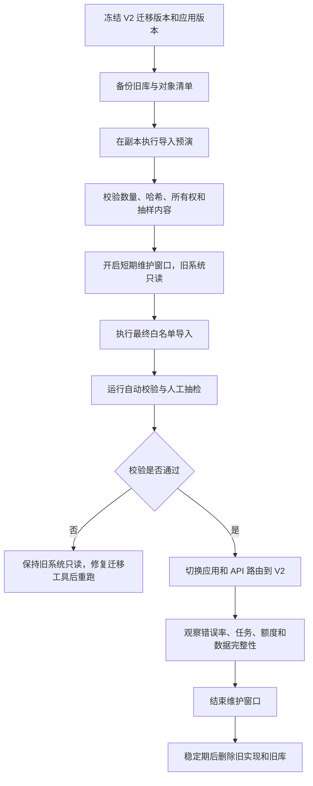

# ExamInsight V2 迁移、切换与验收规范

> 状态：实施门禁冻结稿  
> 当前分支：`new-build`  
> 原则：先完成规格与纵向切片，再迁移数据和删除旧实现；不在旧库上继续打补丁。

## 1. 当前实现审计结论

当前实现可作为 UI、交互和部分供应商接入的参考，但不能直接演进为 V2 数据模型。

主要问题：

1. [`LearningWorkflowController.java`](../../backend/src/main/java/com/example/llm/controller/LearningWorkflowController.java) 同时承担项目准备、计划、任务、题目、评分、资源和错题业务，且大量读写 `payload_json`。
2. [`LearningProjectController.java`](../../backend/src/main/java/com/example/llm/controller/LearningProjectController.java) 使用通用 Map 和 JSON 工作流，没有明确 DTO 与状态机。
3. 项目 JSON 工作流与旧 Plan/Stage/Task/Exercise/Mistake CRUD 同时存在，但前端实际主要使用 JSON 工作流，形成两套不一致的事实来源。
4. [`GenerationJobController.java`](../../backend/src/main/java/com/example/llm/controller/GenerationJobController.java) 允许客户端参与修改任务状态，不符合服务端任务模型。
5. 历史上 `ResourceCenterController.java` 和 [`ResourcesController.java`](../../backend/src/main/java/com/example/llm/controller/ResourcesController.java) 等形成多套资料接口，公共资料市场还包含失败后生成 Mock 数据的行为；公共市场链路已于 2026-08-09 删除，`ResourcesController` 仍待 V2 业务完成后迁移。
6. [`StudentChatView.vue`](../../frontend/src/views/student/chat/StudentChatView.vue) 混入项目准备、画像、资料分析和计划生成流程，普通对话与学习工作流边界不清。
7. [`frontend/src/repositories/learning.ts`](../../frontend/src/repositories/learning.ts) 同时维护 Mock 和生产调用，并使用本地计时器伪造异步进度。
8. [`dataSource.ts`](../../frontend/src/config/dataSource.ts) 允许开发环境默认 Mock，容易掩盖缺失的生产接口。
9. [`AuthInterceptor.java`](../../backend/src/main/java/com/example/llm/interceptor/AuthInterceptor.java)、[`UserServiceImpl.java`](../../backend/src/main/java/com/example/llm/service/impl/UserServiceImpl.java) 和 [`UserController.java`](../../backend/src/main/java/com/example/llm/controller/UserController.java) 仍是 JWT、旧密码找回和不完整邮箱验证模式。
10. 数据库以巨大导出 SQL 和补丁 SQL 为主，尚未建立 Flyway 的可重复建库基线。

因此 V2 采用新 Schema、新领域模块和明确切换，不继续给旧 JSON 增加字段。

## 2. 迁移总原则

### 2.1 不做长期双写

V2 开发期间：

- 旧接口继续服务旧页面。
- V2 接口只读写 `examinsight_v2`。
- 使用功能开关让内部测试用户进入 V2。
- 不把同一业务操作同时写入新旧学习模型。

切换时采用短期维护窗口、一次白名单导入和路由切换。长期双写会制造冲突处理和数据修复系统，禁止采用。

### 2.2 纵向切片

不先批量生成所有 Entity、Mapper 和空 Controller。每个阶段必须交付一条真正可运行的用户链路：

```text
数据库迁移
→ 领域状态机
→ 应用服务
→ 类型化 API
→ 前端页面
→ 自动化测试
→ 监控与失败处理
```

只有该阶段的验收门禁通过后，才进入下一阶段。

### 2.3 新库只接受版本化迁移

- Schema：`examinsight_v2`。
- 旧 `LLM` 进入迁移期后只读。
- 所有结构变化由 Flyway 管理。
- 已执行的版本迁移不得修改；修复必须新增版本。
- 可重复对象只用于视图等可安全重建内容。
- Flyway 不写演示用户、学习项目、题目或 Mock 数据。

## 3. Flyway 顺序

```text
V001__platform_foundation.sql
V002__model_registry_prompt_and_policy.sql
V003__identity_and_auth.sql
V004__storage_and_assets.sql
V005__privacy_and_admin_access.sql
V006__knowledge_bases.sql
V007__conversation_and_ai_runs.sql
V007_1__conversation_cascade_fix.sql
V008__learning_project_sources_targets.sql
V009__concept_scope_exam_format.sql
V010__questions_and_validation.sql
V011__assessments_attempts_grading.sql
V012__diagnostic_and_mastery.sql
V013__gap_analysis_plans_tasks.sql
V014__resource_configuration_generation.sql
V015__task_execution_daily_stats.sql
V016__wrongbook_review.sql
V017__provider_cost_and_quota.sql
V018__evaluation_and_product_events.sql
V019__pointer_foreign_keys_and_checks.sql
V020__reference_catalog_seed.sql
R__admin_metric_views.sql
```

要求：

- 禁止 `USE LLM`。
- 禁止存储过程式“字段不存在就补一列”。
- 每个版本有明确的正向验证 SQL。
- `V019` 才为根对象当前版本指针补循环外键。
- `V020` 只写稳定的参考目录，并使用稳定业务键确保幂等。
- 生产数据库账号不拥有运行时 `DROP DATABASE` 权限。
- `V004` 只创建上传会话、存储对象、资料、资料版本、解析结果、文本切片和向量索引记录；知识库表固定在 `V006`，不得提前创建。
- `V004` 必须验证上传完成幂等、文件/纯文本内容互斥、安全扫描失败关闭、空解析禁止成功、切片 2000 tokens/64 KiB 硬上限和派生索引可重建边界。
- `V005` 只创建隐私目的与声明、处理方、权利请求、导出、账户删除、保留、合法保留、删除编排和管理员限时访问的 19 张表；不得提前创建知识库、对话或学习项目表，也不得写参考数据、用户数据或测试数据。
- `V005` 必须验证：同用户同类型只有一个活动权利请求、同用户只有一个活动导出和账户删除申请、导出令牌只存摘要、`RETAINED` 删除项只有一个保留依据、墓碑不保存原始对象标识、管理员不能自批、内容授权必须绑定对象摘要且最长一小时。
- `V006` 只创建 `knowledge_base`、`knowledge_base_asset`，并为 `asset(id, user_id)` 增加组合唯一键以支持数据库级所有权外键；不得创建对话、项目、资料副本、版本副本、解析副本、向量或业务种子数据。
- `V006` 必须验证：同用户活动/归档规范化名称唯一、回收站释放名称、恢复重名失败、重复关联幂等、跨用户关联被组合外键拒绝、知识库回收站保留关联，以及解除关联或物理删除知识库不删除资料。
- `V007` 只创建能力注册、普通/学习对话骨架、分支、消息、附件、引用、AI 运行、上下文快照、检索证据、工具调用和待确认操作共 14 张表；不得提前创建学习项目、范围、题目、计划、资源或计费表，不得写能力、用户或演示种子数据，也不得保存隐藏推理或供应商原始请求/响应。
- `V007` 必须验证：AI 运行与异步任务属于同一用户、分支和消息不能跨会话、助手消息必须带 AI 标识、消息片段载荷互斥、引用恰好指向一种目标、一次异步任务只有一次 AI 运行、上下文清单为对象、工具调用和待确认操作生命周期闭合，以及学习域和循环指针外键仍留到 `V019`。
- `V007.1` 是 V007 已执行后的前向修复，只把父分支、父消息和编辑来源的自关联外键改为级联删除；不得增加字段、表或数据。它必须验证带父子分支和父子消息的整段会话能够被物理清理。

## 4. 实施阶段

### 阶段 0：规格、工程基础和物理模型

交付：

- 本目录五份规范通过交叉评审。
- 表级逻辑模型细化为字段级数据字典、ER 图和索引清单，见 [PHYSICAL_SCHEMA.md](./PHYSICAL_SCHEMA.md)。
- 每张表明确创建阶段、所有权、保留期和删除顺序。
- 引入 Flyway，但尚不接入用户流量。
- 建立统一错误模型、ULID、UTC 时间、乐观锁、幂等、Outbox 和异步任务基础。
- 建立测试数据库的一键创建与销毁脚本。
- 按 [PHYSICAL_SCHEMA.md 第 22 节](./PHYSICAL_SCHEMA.md#22-公开-beta-部署参数) 固化文件、Session、验证码、任务、生成、保留和 MySQL 默认参数。

门禁：

- 从空数据库执行所有已有迁移成功。
- 第二次启动不产生结构变化。
- 数据字典、迁移 SQL、Java 类型和 API DTO 的状态值一致。
- 不允许先写表再反推业务含义。

### 阶段 1：身份、资料、知识库和普通对话

交付：

- 邮箱注册、反滥用验证、登录、会话、找回密码。
- 当前真实实现状态见 [AUTH_IMPLEMENTATION.md](./AUTH_IMPLEMENTATION.md)。注册、登录和普通 Session 第一纵向链路已经接通；高风险登录邮箱升级验证、邮件链接找回密码与浏览器 UI 仍未实现，不得提前展示。
- 资料上传、版本、解析、个人资料库和知识库。
- 普通对话、四个通用能力、分支、流式响应、引用和额度基础。
- 对象存储、检索索引和异步任务恢复。

门禁：

- 用户不能读取、关联、下载或删除其他用户资料。
- 邮箱验证码不能绕过频率限制；重放和暴力尝试被阻止。
- 答案、系统提示、供应商密钥和原始错误不出现在响应或日志。
- SSE 断线重连后不会重复生成或重复扣费。
- 生产模式不回退到 Mock。

### 阶段 2：项目、目标、学习依据和考试范围

交付：

- 创建项目弹窗和准备页前三步。
- 考试目标版本、可学习时间和日期校验。
- 项目依据候选、解析就绪检查、版本锁定。
- 范围生成、引用、冲突处理、手工编辑和确认。

门禁：

- 知识库修改不会静默改变已确认项目依据。
- 解析失败资料不能被误认为就绪。
- 未解决阻断级范围冲突不能确认。
- 页面刷新、关闭和跨设备登录后以服务端状态恢复。
- 不再使用 SessionStorage 作为学习项目事实来源。

### 阶段 3：题目、测评、诊断与掌握度

交付：

- 题目版本、引用、答案隔离和质量硬校验。
- 统一测评、固定试卷版本、作答、提交、评分和重评分。
- 基础诊断、诊断跳过和掌握度证据。
- 离线评测最小集和人工抽检流程。

门禁：

- 未发布或校验失败题目不能进入测评。
- 模拟试卷提交前不能通过任何接口获取答案。
- 提交接口幂等；重复提交不产生第二份评分和额度扣减。
- 撤回错误题目后能重评分并重算掌握度。
- 无证据概念保持 `UNKNOWN`。

### 阶段 4：计划、资源、执行和错题

交付：

- 差距分析、计划生成、手工/AI 修改、版本比较和确认。
- 资源需求、额度估算、两日滚动生成和“生成全部可预测资源”。
- 今日学习、任务执行、有效时间热力图和提前学习。
- 错题订正、立即变式和 D1/D3/D7 复习。

门禁：

- 正在执行和已完成任务不被重排覆盖。
- 生成批次部分失败可以单项重试且不重复扣费。
- 客户端不能自行写任务完成状态或有效学习秒数。
- 跳过强化后可以执行依赖满足的下一日任务。
- 阅读解析或写订正笔记不会直接提高掌握度。

### 阶段 5：学习助教、计费、后台和隐私

交付：

- 项目受约束上下文、工具调用和待确认操作。
- 模型策略、提示版本、质量评测、供应商成本和用户额度账本。
- 质量、成本、漏斗、学习、性能和安全后台。
- 导出、回收站、账户删除、保留任务和管理员访问审计。

门禁：

- AI 无法绕过确认直接改变目标、依据、范围和计划。
- 额度预占、结算、释放和供应商实际成本能够对账。
- 失败无结果时释放用户额度，平台重试不重复扣费。
- 删除任务能够覆盖 MySQL、对象存储、检索索引和缓存。
- 管理员读取用户内容必须有 MFA、工单、限时授权和审计。

### 阶段 6：白名单迁移、切换和旧代码删除

交付：

- 旧库一致性报告和导入预演报告。
- 白名单导入、抽样验证和映射表。
- V2 路由切换、旧库只读和监控观察。
- 稳定期结束后删除旧学习工作流、公共资料市场和 Mock 生产降级。

门禁：

- 导入脚本重复运行不重复创建数据。
- 成功、跳过、失败均有明确记录和原因。
- 切换后生产请求不再访问旧学习表。
- 旧端点返回明确下线结果，不再被前端调用。
- 删除旧实现前完成代码引用、路由、定时任务和数据库连接扫描。

## 5. 旧数据白名单

### 5.1 建议导入

| 旧数据 | 处理方式 |
|---|---|
| 有效原始文件 | 验证所有者、文件存在、大小、哈希和 MIME 后导入 `asset/asset_version/storage_object` |
| `knowledge_base` | 导入名称和描述，再根据有效文件重建关联 |
| `document` | 只作为文件迁移来源；分块和向量使用 V2 解析器重建 |
| 思维导图、PPT、图片等生成产物 | 文件或结构有效时作为普通 `asset` 导入并标记来源 |
| 对话和消息 | 用户确实需要时导入只读历史档案；默认不进入活跃 V2 分支模型 |

### 5.2 默认不导入

```text
learning_project.payload_json
learning_project.setup_state_json
learning_project.active_generation_json
learning_project.exercise_drafts_json
旧 learning_plan / learning_stage / learning_task
旧 learning_exercise / learning_mistake / learning_activity
旧 learning_resource
旧 generation_job 及进度
缓存的数量、进度、掌握度和统计
公共资料市场 resource / user_resource
Mock、演示和压力测试数据
system_config 中的密钥或部署配置
```

### 5.3 用户账户

旧账户缺少经过验证的邮箱时不得直接成为可登录的公开 Beta 账户。

默认策略：

- 公开 Beta 从空账户体系开始。
- 若必须保留旧账户，使用一次性“认领账户”流程：验证邮箱后创建 V2 身份，再关联允许迁移的资料。
- 不把旧 BCrypt 密码直接当成已验证的新账户凭据。
- 本地开发管理员和测试用户由非生产种子或测试夹具创建，禁止混入生产迁移。

### 5.4 导入审计

迁移工具使用 `legacy_import_map`：

```text
source_schema
source_table
source_primary_key
target_type
target_external_id
source_checksum
status: IMPORTED | SKIPPED | FAILED
reason_code
async_job_id
created_at
```

每次导入先生成只读预演报告。存在所有权不明、文件不存在、哈希不符或 JSON 无法安全解析时跳过，不猜测修复。

## 6. 切换流程



### 6.1 回滚边界

- V2 尚未接受新用户写入前，可以回到旧应用和旧库。
- V2 开始接受新写入后，数据库只允许向前修复；不能简单回到旧学习模型，否则会丢失 V2 数据。
- 应用代码可以回滚到仍兼容 V2 Schema 的上一版本。
- 数据迁移使用新版本修复，不运行破坏性 Down Migration。
- 旧库在稳定观察期保持只读快照，不承担继续写入和双写兜底。

## 7. 旧代码处置清单

### 7.1 完全替换后删除

- [`LearningWorkflowController.java`](../../backend/src/main/java/com/example/llm/controller/LearningWorkflowController.java)。
- [`LearningPlanController.java`](../../backend/src/main/java/com/example/llm/controller/LearningPlanController.java)。
- [`LearningStageController.java`](../../backend/src/main/java/com/example/llm/controller/LearningStageController.java)。
- [`LearningTaskController.java`](../../backend/src/main/java/com/example/llm/controller/LearningTaskController.java)。
- [`LearningExerciseController.java`](../../backend/src/main/java/com/example/llm/controller/LearningExerciseController.java)。
- [`LearningMistakeController.java`](../../backend/src/main/java/com/example/llm/controller/LearningMistakeController.java)。
- [`LearningActivityController.java`](../../backend/src/main/java/com/example/llm/controller/LearningActivityController.java)。
- [`LearningResourceController.java`](../../backend/src/main/java/com/example/llm/controller/LearningResourceController.java)。
- 与上述 Controller 对应的旧 Entity、Mapper、Service 和前端旧 API。
- 公共资料市场页面、`ResourceCenterController`、相关 Mock 数据和 `resource/user_resource` 领域代码已于 2026-08-09 删除。
- 旧 Mock 学习生成器和浏览器本地业务存储。

删除条件不是“已有新文件”，而是对应 V2 用户链路、自动化测试、数据迁移和生产监控全部通过。

### 7.2 重写，不直接复制

- [`LearningProjectController.java`](../../backend/src/main/java/com/example/llm/controller/LearningProjectController.java)：替换为 DTO、应用服务和状态机接口。
- [`GenerationJobController.java`](../../backend/src/main/java/com/example/llm/controller/GenerationJobController.java)：替换为只读任务状态及受约束的重试/取消操作。
- [`ResourcesController.java`](../../backend/src/main/java/com/example/llm/controller/ResourcesController.java)：并入统一资料与知识库 API。
- [`UserController.java`](../../backend/src/main/java/com/example/llm/controller/UserController.java)：改为邮箱挑战、服务端会话和新密码重置链路。
- [`AuthInterceptor.java`](../../backend/src/main/java/com/example/llm/interceptor/AuthInterceptor.java)：改为 Session Cookie、CSRF 和风险控制。
- [`StudentChatView.vue`](../../frontend/src/views/student/chat/StudentChatView.vue)：保留普通对话视觉部分，移除学习准备状态和本地持久化。
- [`frontend/src/repositories/learning.ts`](../../frontend/src/repositories/learning.ts)：替换为 V2 类型化 Repository，不保留 Mock/API 双实现。

### 7.3 可以提取复用

- 现有 PDF/Word 等解析能力，但必须置于 `asset_parse_result` 和异步任务边界下。
- 现有 DashScope、讯飞等供应商调用代码，但必须封装成 Provider Adapter，不能由 Controller 直接调用。
- 已有项目卡、步骤卡、任务卡、对话气泡、抽屉等视觉样式，在去除旧业务状态后可复用。
- 现有统一主题 Store 和 `data-theme` 机制，扩展为语义 Token。

## 8. 自动化测试定义

自动化测试是由程序重复执行并自动判断结果的检查，不依赖每次人工点击。V2 至少包含以下层级。

### 8.1 单元测试

覆盖纯业务规则：

- 项目准备状态推导。
- 可学习日期和时间预算计算。
- 任务依赖和提前学习判断。
- 计划版本可修改范围。
- 任务完成规则。
- 掌握度证据和标签计算。
- 错题复习状态转换。
- 额度预占、结算和释放。

### 8.2 数据库与 Repository 测试

使用真实 MySQL 测试容器，而不是用 H2 猜测 MySQL 行为：

- 唯一约束、外键和 `CHECK`。
- 乐观锁冲突。
- 幂等键竞争。
- Outbox 与业务事务原子性。
- 异步任务并发领取和租约失效恢复。
- 删除顺序和所有权查询。

### 8.3 API 契约测试

- DTO 字段、状态码和稳定错误码。
- 未登录、越权、跨项目引用和 ID 枚举。
- `ETag/If-Match` 和 `Idempotency-Key`。
- 答案泄漏、供应商错误泄漏和日志脱敏。
- SSE 重连、取消、失败和最终状态查询。

### 8.4 状态机测试

每个状态测试：

- 所有允许的出边。
- 所有禁止的出边。
- 重复执行。
- 并发确认。
- 依赖版本已变化。
- 异步任务在状态切换中失败。

禁止只测试“最顺利的一条路径”。

### 8.5 前端测试

- Repository 契约测试，不再切到 Mock 验证成功页面。
- 项目六步准备流程及刷新恢复。
- 加载、空、部分成功、失败、重试、额度不足和版本冲突状态。
- 浅色/深色主题截图对比。
- 键盘操作、焦点、ARIA、窄屏和长文本。

### 8.6 AI 评测

- 固定数据集对不同模型策略和提示版本重复评测。
- 题目正确性、引用支持、难度、重复度和范围覆盖。
- 计划时间可行性、优先级合理性和解释完整性。
- 结构化输出 Schema 通过率和工具选择正确率。
- 每次模型、提示或编排变更必须对比基线；高风险指标退化时阻止发布。

## 9. 非功能验收目标

以下是 Beta 初始工程目标，可以根据真实观测调整，但修改必须留记录：

| 项目 | 初始目标 |
|---|---|
| 普通读取 API | 不含 AI/文件下载时 p95 < 500 ms |
| 普通写入 API | 不含异步执行时 p95 < 800 ms |
| 异步接受响应 | p95 < 1 s，立即返回任务 ID |
| SSE 状态首包 | 已接受任务后 1 s 内返回接受/排队状态 |
| 可用性 | 核心已有内容在模型故障时仍可读取 |
| 幂等 | 网络重试不产生重复计划、作答、资源或扣费 |
| 可恢复任务 | Worker 异常后租约到期可重试，且不重复落业务结果 |
| 可观测性 | 每个请求、任务、AI 运行、调用和账本可通过关联 ID 追踪 |

不要为了满足延迟目标而跳过所有权校验、答案隔离、质量校验或计费预占。

## 10. 安全验收清单

- Argon2id 参数完成目标部署机器基准测试，单次验证初始目标 250–500 ms。
- 密码支持 15–128 个 Unicode 字符和空格，阻止常见/泄漏密码。
- 邮箱验证码按邮箱、账户、IP、设备和全局限流。
- Session Cookie 使用 `Secure`、`HttpOnly`、`SameSite=Lax` 和 `__Host-` 前缀。
- 普通用户 Session 按 24 小时无活动、30 天绝对过期和 24 小时轮换执行；管理员按 30 分钟无活动、12 小时绝对过期执行。
- 所有状态修改接口验证 CSRF。
- 会话支持单个撤销、全部撤销、密码修改后撤销和风险撤销。
- 管理员使用独立身份、独立会话、MFA 和更短过期时间。
- 上传检查扩展名、MIME、魔数、大小、压缩炸弹和恶意内容。
- 恶意内容扫描不可用时保持隔离，不允许跳过扫描进入解析。
- 下载使用短期授权，不返回永久公开对象 URL。
- Prompt Injection 不能扩大资料范围或调用未授权写工具。
- 日志不记录密码、验证码、完整会话令牌、模型密钥、答案密钥和完整用户资料正文。
- MySQL 使用 InnoDB、UTC、`utf8mb4`、`READ COMMITTED` 和严格 SQL Mode；Beta 阶段不启用表分区。

## 11. 数据与计费验收清单

- 所有核心工作流字段均可通过关系查询获得，不读取旧项目 JSON。
- 项目依据明确指向资料版本和解析结果。
- 题目版本、测评版本、作答和评分不可被覆盖。
- 每条掌握度结论能够追溯到有效证据。
- 计划重排不会篡改已执行任务。
- 用户额度交易之和与账户余额一致。
- 供应商调用用量之和可与供应商账单按日核对。
- 预占超过超时仍未结算时有自动对账任务。
- 失败、取消和平台重试均有明确扣费规则。
- 用户删除后，数据库、对象存储、分块、向量、缓存和导出包均进入清理清单。

## 12. 发布门禁

任何阶段发布前必须同时满足：

```text
产品规格已覆盖该链路
数据字典和迁移已评审
API DTO 与状态机一致
正常、异常、降级和越权测试通过
浅色/深色 UI 检查通过
日志、指标和告警可定位问题
数据回滚/向前修复边界明确
旧调用方已统计且有删除日期
```

以下情况直接阻止公开 Beta：

- 生产环境仍会在接口失败后展示 Mock 成功数据。
- 客户端可以修改任务/生成任务状态、有效学习时间或余额。
- 答案可能在提交前泄漏。
- 题目没有硬校验和引用。
- AI 可以未经确认修改目标、依据、范围或计划。
- 数据删除只删 MySQL，不处理文件、分块和向量。
- 成本账本无法与用户额度和供应商用量对账。
- 新库不能从空环境完整创建。

## 13. 文档与实现变更规则

- 产品行为变化先修改 [PRODUCT_SPEC.md](./PRODUCT_SPEC.md)。
- 领域关系、事实来源或保留规则变化先修改 [DATA_MODEL.md](./DATA_MODEL.md)。
- 字段、类型、主外键、索引和删除顺序变化修改 [PHYSICAL_SCHEMA.md](./PHYSICAL_SCHEMA.md)。
- 接口、状态或错误变化先修改 [API_AND_STATE_MACHINES.md](./API_AND_STATE_MACHINES.md)。
- 阶段、迁移、切换或验收变化修改本文。
- 文档变更必须说明影响的数据迁移、前端状态、API 兼容和测试。
- 不允许只改数据库字段而不更新相应规格，也不允许只改 UI 掩盖后端状态缺失。
