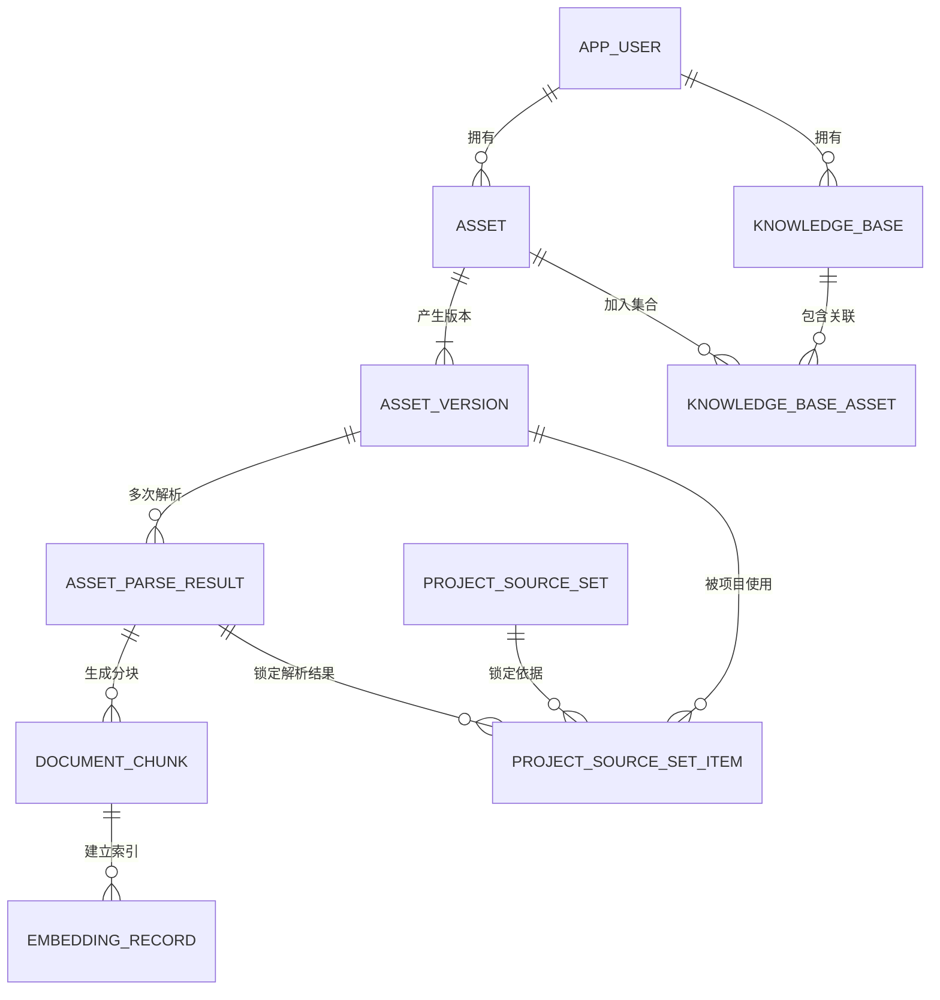
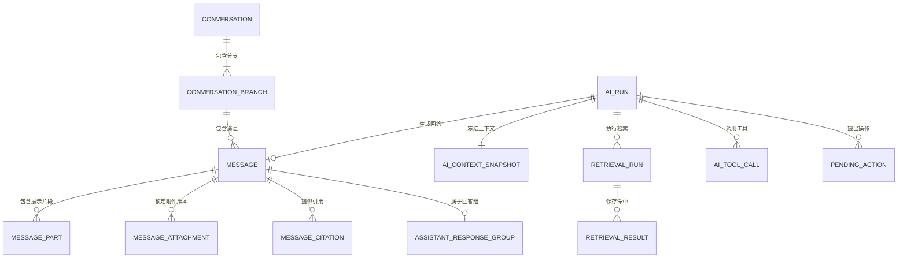
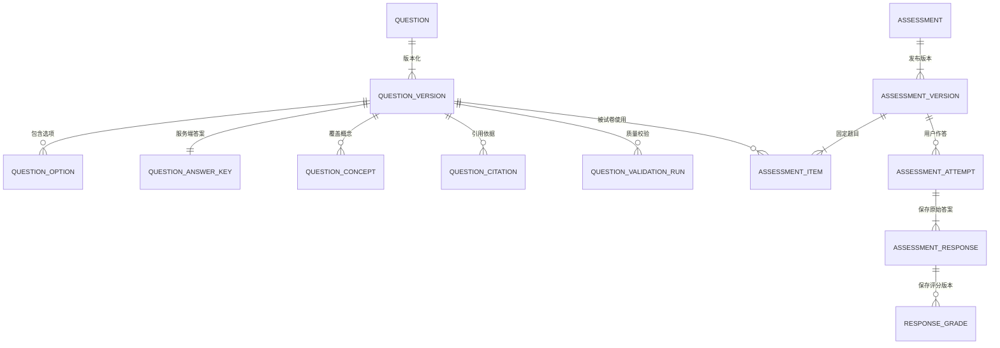
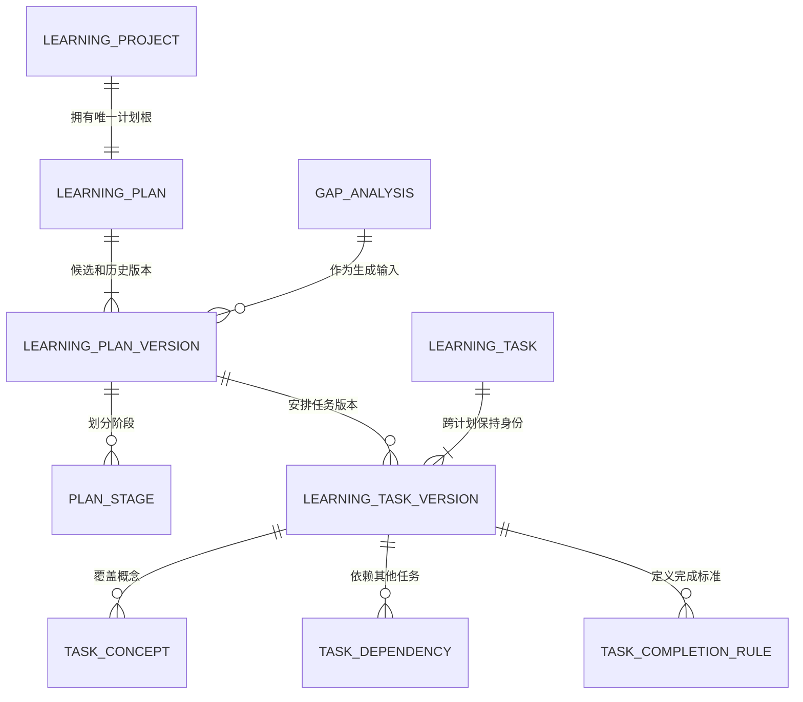
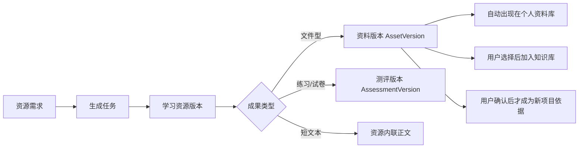
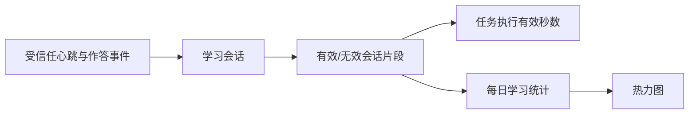
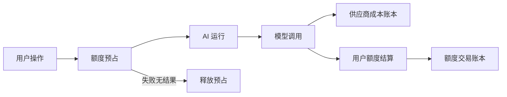

# ExamInsight V2 物理数据字典

> 状态：DDL 前字段级评审稿  
> 目标：把 [DATA_MODEL.md](./DATA_MODEL.md) 的逻辑模型机械化为字段、键、索引和删除规则；本文通过评审前不得创建生产 Schema。  
> 注意：表不是业务模块。以下物理表只归属于 12 个领域服务，禁止按“一张表一个 Controller/Service”生成 CRUD 系统。

## 1. 记号与统一类型

### 1.1 字段记号

- `?`：允许 `NULL`。
- `UQ`：唯一约束。
- `IDX`：普通/组合索引的一部分。
- `FK→table`：外键目标；未写删除规则时默认 `RESTRICT`。
- `CASCADE`：父对象物理删除时只删除纯子项/关联项。
- `SET NULL`：仅用于保留审计但解除可选指针。
- `JSON`：只能承载本文明确允许的快照、属性或供应商诊断，不能承载核心状态。

### 1.2 统一类型

| 语义 | MySQL 类型 | 规则 |
|---|---|---|
| 内部主键 | `BIGINT UNSIGNED` | `AUTO_INCREMENT`，不出现在 API |
| 外部 ID | `CHAR(26)` | 单调 ULID，ASCII 二进制排序，`UQ` |
| 状态/类型键 | `VARCHAR(32)` | Java 枚举 + `CHECK`，不使用 MySQL ENUM |
| 目录键 | `VARCHAR(64)` | 稳定英文键，不使用展示文案做关联 |
| 名称 | `VARCHAR(160)` | 去首尾空白，限制控制字符 |
| 邮箱规范化值 | `VARCHAR(254)` | 小写域名、应用层规范化，二进制唯一索引 |
| 内容摘要 | `CHAR(64)` | SHA-256 十六进制小写 |
| 金额 | `DECIMAL(20,8)` | 同时保存币种 `CHAR(3)` |
| Token/计数 | `BIGINT UNSIGNED` | 不使用浮点 |
| 比例/置信度 | `DECIMAL(7,6)` | 范围 `0–1` |
| UTC 时间 | `DATETIME(3)` | 应用连接固定 UTC |
| 本地计划日期 | `DATE` | 必须配合项目 IANA 时区解释 |
| 长正文 | `LONGTEXT` | 大文件不进入数据库 |

表格中省略类型的字段必须按以下确定性规则展开；不匹配这些规则的字段在生成 DDL 前必须补写显式类型：

| 字段形态 | 展开类型 |
|---|---|
| `*_id` | `BIGINT UNSIGNED`；带 `FK→` 时建立外键 |
| `*_external_id` | `CHAR(26)` |
| `*_at` | `DATETIME(3)` |
| `*_date` | `DATE` |
| `*_hash` | `CHAR(64)` |
| `*_json` | `JSON` |
| `status`、`*_status`、`*_type`、`*_mode`、`*_level`、`*_role`、`*_source` | `VARCHAR(32)` |
| `*_key`、`*_code`、`*_reason` | `VARCHAR(64)` |
| `*_score`、`confidence`、`weight`、`percentage`、`difficulty*` | `DECIMAL(7,6)` |
| `*_count`、`*_no`、`*_order`、`*_minutes`、`*_seconds` | `INT`；明确为大规模账本计数时使用 `BIGINT UNSIGNED` |
| `source_ref`、`provider_request_id`、`provider_message_id` | `VARCHAR(255)` |

### 1.3 通用字段模板

数据字典中的“模板”包含以下字段，表格只列额外领域字段。

| 模板 | 固定字段 |
|---|---|
| `ROOT_USER` | `id BIGINT PK`、`external_id CHAR(26) UQ`、`user_id BIGINT FK→app_user`、`row_version BIGINT DEFAULT 0`、`created_at`、`updated_at` |
| `ROOT_USER_SOFT` | `ROOT_USER` 全部字段，加 `deleted_at?`；只用于真正进入回收站的根对象 |
| `ROOT_SYSTEM` | `id BIGINT PK`、`external_id CHAR(26) UQ`、`row_version BIGINT DEFAULT 0`、`created_at`、`updated_at` |
| `ROOT_SYSTEM_SOFT` | `ROOT_SYSTEM` 全部字段，加 `deleted_at?` |
| `CHILD` | `id BIGINT PK`、`external_id CHAR(26) UQ`、`created_at`、`updated_at` |
| `MUTABLE_RECORD` | `id BIGINT PK`、`external_id CHAR(26) UQ`、`row_version BIGINT DEFAULT 0`、`created_at`、`updated_at`；业务标识和载荷不可覆盖，只允许状态、租约、心跳或结果字段按状态机更新 |
| `IMMUTABLE` | `id BIGINT PK`、`external_id CHAR(26) UQ`、`created_at`；创建后只允许追加失效/选中指针，不修改正文 |
| `LINK` | `id BIGINT PK`、`created_at`；至少一个联合唯一约束 |
| `LEDGER` | `id BIGINT PK`、`external_id CHAR(26) UQ`、`created_at`；只追加，禁止 UPDATE/DELETE |

所有包含 `user_id` 或 `project_id` 的表均建立以其开头的访问索引。所有外键列均建索引，即使下表未逐一重复写出。

### 1.4 约束命名与字符集

```text
主键             pk_<table>
唯一约束         uq_<table>__<column_keys>
普通索引         idx_<table>__<column_keys>
外键             fk_<table>__<column>__<target>
检查约束         ck_<table>__<rule_key>
```

名称超过 MySQL 64 字符时，保留表名、首个字段语义和 8 位稳定哈希，禁止人工随意缩写导致不同迁移使用不同名称。

- Schema 默认 `utf8mb4`；普通展示文本使用 `utf8mb4_0900_ai_ci`。
- ULID、状态键、目录键、内容哈希、令牌摘要和幂等键使用 ASCII/二进制排序规则。
- 邮箱先由应用规范化，再对 `normalized_email` 建唯一索引；原始展示邮箱不参与登录比较。
- 每张表显式使用 `ENGINE=InnoDB`，不依赖服务器默认引擎。

## 2. 领域边界与创建阶段

| 阶段 | 领域服务 | 物理表职责 |
|---|---|---|
| 0 | Platform | 幂等、异步任务、Outbox、审计、模型目录 |
| 1 | Identity、Asset、Knowledge、Conversation | 登录、资料、知识库、普通对话 |
| 2 | Learning Setup、Scope | 项目、目标、依据、范围、考试结构 |
| 3 | Question、Assessment、Mastery | 题目、诊断、评分和掌握度 |
| 4 | Plan、Resource、Execution、Wrongbook | 计划、资源、每日学习和错题闭环 |
| 5 | AI Governance、Billing、Privacy、Admin | 路由、评测、额度、隐私和后台 |

当前完整候选模型共 162 张物理表，分布为平台 8、身份 14、隐私 19、资料 9、对话 14、学习准备与范围 17、题目/测评/掌握度 27、计划/资源/执行/错题 35、AI 治理与计费评测 19。数量来自不可变版本、类型化答案、关联表、账本和隐私审计，并不代表要创建 162 套业务类。

实施仍必须按阶段纵向创建；任何阶段不得先批量生成尚无用户链路的空表和空 CRUD。字段审计已经删除了独立文本答案子表：单值短文本直接存入 `assessment_response.text_answer`，多选答案才使用关联表。

## 3. Platform：平台基础

### 3.1 表字段

| 表/模板 | 领域字段 | 唯一约束与重点索引 | 删除与说明 |
|---|---|---|---|
| `async_job` / `ROOT_SYSTEM` | `user_id? FK→app_user`；`job_type VARCHAR(64)`；`aggregate_type VARCHAR(64)?`；`aggregate_external_id CHAR(26)?`；`status VARCHAR(32)`；`stage_key VARCHAR(64)?`；`progress_current BIGINT DEFAULT 0`；`progress_total BIGINT?`；`priority SMALLINT DEFAULT 100`；`idempotency_scope VARCHAR(96)?`；`idempotency_key VARCHAR(128)?`；`cancellable BOOLEAN`；`payload_json JSON?`；`result_json JSON?`；`scheduled_at`；`started_at?`；`heartbeat_at?`；`finished_at?`；`error_code VARCHAR(64)?`；`safe_error_message VARCHAR(500)?`；`lease_owner VARCHAR(128)?`；`lease_expires_at?`；`attempt_count INT DEFAULT 0`；`max_attempts INT` | `UQ(idempotency_scope, job_type, idempotency_key)`（两个幂等字段同时非空）；`IDX(status, scheduled_at, priority)`；`IDX(aggregate_type, aggregate_external_id)` | scope 由服务端生成为用户/系统隔离值；payload/result 只放执行参数和安全摘要 |
| `async_job_attempt` / `MUTABLE_RECORD` | `async_job_id FK→async_job CASCADE`；`attempt_no INT`；`worker_id VARCHAR(128)`；`status VARCHAR(32)`；`started_at`；`heartbeat_at?`；`finished_at?`；`error_code?`；`diagnostic_json JSON?` | `UQ(async_job_id, attempt_no)`；`IDX(worker_id, status)` | worker 与 attempt_no 创建后不可改；只更新心跳、状态和脱敏诊断结果 |
| `outbox_event` / `MUTABLE_RECORD` | `aggregate_type VARCHAR(64)`；`aggregate_external_id CHAR(26)`；`event_type VARCHAR(96)`；`event_version INT`；`payload_json JSON`；`status VARCHAR(32)`；`available_at`；`published_at?`；`attempt_count INT`；`last_error_code?`；`lease_owner?`；`lease_expires_at?` | `IDX(status, available_at)`；`IDX(aggregate_type, aggregate_external_id, id)`；`IDX(status, lease_expires_at)` | 与业务写入同事务；事件标识和 payload 永不覆盖，只更新投递租约与结果；发布后按保留策略归档 |
| `idempotency_record` / `MUTABLE_RECORD` | `user_id? FK→app_user`；`actor_scope VARCHAR(96)`；`scope_key VARCHAR(96)`；`idempotency_key VARCHAR(128)`；`request_hash CHAR(64)`；`status VARCHAR(32)`；`response_status SMALLINT?`；`response_ref_type?`；`response_ref_external_id?`；`expires_at` | `UQ(actor_scope, scope_key, idempotency_key)`；`IDX(user_id, expires_at)`；`IDX(expires_at)` | 请求标识和摘要不可改；首次执行只把 PROCESSING 更新为最终结果；actor_scope 解决匿名/系统请求中 user_id 为空时的唯一键问题 |
| `domain_audit_event` / `LEDGER` | `user_id? FK→app_user`；`actor_type VARCHAR(32)`；`actor_external_id CHAR(26)?`；`aggregate_type VARCHAR(64)`；`aggregate_external_id CHAR(26)`；`event_type VARCHAR(96)`；`base_version? BIGINT`；`new_version? BIGINT`；`reason_code?`；`change_summary_json JSON?`；`request_id CHAR(26)?`；`occurred_at` | `IDX(aggregate_type, aggregate_external_id, occurred_at)`；`IDX(user_id, occurred_at)` | 只存必要变更摘要，不复制正文 |
| `legacy_import_map` / `MUTABLE_RECORD` | `async_job_id FK→async_job`；`source_schema VARCHAR(64)`；`source_table VARCHAR(64)`；`source_primary_key VARCHAR(128)`；`source_checksum CHAR(64)?`；`target_type VARCHAR(64)?`；`target_external_id CHAR(26)?`；`status VARCHAR(32)`；`reason_code VARCHAR(64)?` | `UQ(source_schema, source_table, source_primary_key)`；`IDX(async_job_id, status)` | 来源标识不可改，只更新最终导入结果；仅供白名单迁移和审计，不成为业务查询入口 |
| `model_provider` / `ROOT_SYSTEM` | `provider_key VARCHAR(64)`；`display_name VARCHAR(120)`；`status VARCHAR(32)`；`base_url VARCHAR(500)?`；`credential_secret_ref VARCHAR(255)`；`region?`；`timeout_ms INT`；`metadata_json JSON?` | `UQ(provider_key)`；`IDX(status)` | 服务地址不是密钥；凭据只保存密钥管理服务引用 |
| `model_definition` / `ROOT_SYSTEM` | `provider_id FK→model_provider`；`model_key VARCHAR(96)`；`provider_model_name VARCHAR(160)`；`role VARCHAR(32)`；`status VARCHAR(32)`；`context_token_limit BIGINT?`；`max_output_tokens INT?`；`supports_tools BOOLEAN`；`supports_json_schema BOOLEAN`；`supports_streaming BOOLEAN`；`capability_json JSON?` | `UQ(provider_id, provider_model_name)`；`UQ(model_key)`；`IDX(role, status)` | 能力元数据可 JSON；不得存计价历史 |

### 3.2 约束

- `async_job.status` 只允许 `QUEUED/RUNNING/RETRY_WAIT/SUCCEEDED/FAILED/CANCELLING/CANCELLED`。
- `async_job_attempt.status` 只允许 `RUNNING/SUCCEEDED/FAILED/CANCELLED/LEASE_EXPIRED`。
- `outbox_event.status` 只允许 `PENDING/PUBLISHING/RETRY_WAIT/PUBLISHED/DEAD_LETTER`；`PUBLISHING` 必须持有可过期租约，崩溃后允许重新领取。
- `idempotency_record.status` 只允许 `PROCESSING/SUCCEEDED/FAILED`；请求标识与请求摘要创建后不可修改。
- `legacy_import_map.status` 只允许 `PENDING/IMPORTED/SKIPPED/FAILED`；同一旧记录只能映射一次。
- Worker 领取任务必须使用原子条件更新租约，不使用进程内线程池作为唯一执行保障。
- `outbox_event` 与领域写入同事务，消费者按事件 ID 幂等。
- 平台表不会对应公共 CRUD Controller。
- `V001` 先创建 `async_job.user_id`、`idempotency_record.user_id` 和 `domain_audit_event.user_id` 普通索引；`app_user` 在 `V003` 创建后再补三个外键，禁止让平台迁移反向依赖尚不存在的身份表。

## 4. Identity：用户、登录与安全

| 表/模板 | 领域字段 | 唯一约束与重点索引 | 删除与说明 |
|---|---|---|---|
| `app_user` / `ROOT_SYSTEM_SOFT` | `normalized_email VARCHAR(254)`；`email_display VARCHAR(254)`；`status VARCHAR(32)`；`age_gate_acknowledged_at`；`email_verified_at?`；`last_login_at?`；`session_version BIGINT DEFAULT 1`；`trash_started_at?`；`previous_status?` | `UQ(normalized_email)`；`IDX(status, created_at)` | 不收集真实姓名、学号、学校、电话和出生日期；全部退出、改密和密码重置递增 `session_version` |
| `user_credential` / `CHILD` | `user_id FK→app_user CASCADE`；`credential_type VARCHAR(32)`；`password_hash VARCHAR(512)`；`hash_policy_key VARCHAR(64)`；`password_changed_at`；`compromised_checked_at?`；`disabled_at?` | `UQ(user_id, credential_type)` | 密码字段禁止进入日志和审计摘要 |
| `user_profile` / `CHILD` | `user_id FK→app_user CASCADE`；`display_name VARCHAR(80)`；`avatar_asset_id? FK→asset SET NULL`；`bio VARCHAR(300)?` | `UQ(user_id)` | 非必要个人资料保持可选；头像资料仍受 asset 权限控制 |
| `user_setting` / `CHILD` | `user_id FK→app_user CASCADE`；`theme VARCHAR(16)`；`locale VARCHAR(16)`；`timezone VARCHAR(64)`；`reduced_motion BOOLEAN`；`email_notification_enabled BOOLEAN`；`learning_reminder_enabled BOOLEAN` | `UQ(user_id)` | 主题值限定 `SYSTEM/LIGHT/DARK` |
| `user_device` / `ROOT_USER` | `device_fingerprint_hash CHAR(64)`；`display_name VARCHAR(120)?`；`first_seen_at`；`last_seen_at`；`trust_status VARCHAR(32)`；`risk_level VARCHAR(16)`；`revoked_at?` | `UQ(user_id, device_fingerprint_hash)`；`IDX(user_id, last_seen_at)` | 只存匿名摘要，不采集原始指纹材料 |
| `auth_session` / `ROOT_USER` | `device_id? FK→user_device SET NULL`；`token_hash CHAR(64)`；`token_version INT DEFAULT 1`；`status VARCHAR(32)`；`auth_level VARCHAR(32)`；`csrf_secret_hash CHAR(64)`；`ip_prefix_hash CHAR(64)?`；`user_agent_hash CHAR(64)?`；`issued_at`；`token_rotated_at`；`last_seen_at`；`idle_expires_at`；`absolute_expires_at`；`step_up_verified_at?`；`revoked_at?`；`revoke_reason?` | `UQ(token_hash)`；`IDX(user_id, status, absolute_expires_at)` | Cookie 保存原令牌，数据库只存摘要；令牌轮换递增版本并原子替换摘要 |
| `email_verification` / `ROOT_SYSTEM` | `user_id? FK→app_user SET NULL`；`normalized_email`；`purpose VARCHAR(32)`；`code_hash CHAR(64)`；`verification_proof_hash CHAR(64)?`；`status VARCHAR(32)`；`expires_at`；`verified_at?`；`proof_expires_at?`；`attempt_count INT`；`max_attempts INT`；`consumed_at?`；`request_ip_hash?`；`device_hash?`；`active_email_key VARCHAR(254) GENERATED` | `UQ(active_email_key, purpose)`；`IDX(normalized_email, purpose, created_at)`；`IDX(status, expires_at)` | 验证成功返回一次性高熵证明，数据库只存摘要；同邮箱同用途只允许一个待处理挑战；过期后按安全保留期清理 |
| `email_delivery` / `ROOT_SYSTEM` | `verification_id? FK→email_verification SET NULL`；`user_id? FK→app_user SET NULL`；`template_key VARCHAR(64)`；`recipient_hash CHAR(64)`；`provider_key VARCHAR(64)`；`provider_message_id?`；`status VARCHAR(32)`；`attempt_count INT`；`sent_at?`；`delivered_at?`；`failed_at?`；`failure_code?` | `IDX(status, created_at)`；`IDX(provider_key, provider_message_id)` | 不保存邮件正文和明文验证码 |
| `password_reset_token` / `ROOT_SYSTEM` | `user_id FK→app_user CASCADE`；`token_hash CHAR(64)`；`status VARCHAR(32)`；`expires_at`；`consumed_at?`；`request_ip_hash?`；`session_version_at_issue BIGINT`；`active_slot TINYINT GENERATED` | `UQ(token_hash)`；`UQ(user_id, active_slot)`；`IDX(user_id, status, expires_at)` | `active_slot` 仅在有效时为 1；每个用户最多一个有效令牌；使用后一次性失效；密码更新后递增会话版本并撤销旧会话 |
| `security_event` / `LEDGER` | `user_id? FK→app_user SET NULL`；`event_type VARCHAR(64)`；`severity VARCHAR(16)`；`normalized_email_hash?`；`device_id? FK→user_device SET NULL`；`session_id? FK→auth_session SET NULL`；`ip_prefix_hash?`；`risk_score DECIMAL(7,6)?`；`metadata_json JSON?`；`occurred_at` | `IDX(user_id, occurred_at)`；`IDX(event_type, occurred_at)`；`IDX(severity, occurred_at)` | 安全事件保留期独立；不得存原始密码/验证码/Token |
| `admin_user` / `ROOT_SYSTEM` | `normalized_email`；`display_name`；`status`；`last_login_at?` | `UQ(normalized_email)` | 与 `app_user` 完全隔离，不共享会话和凭据 |
| `admin_mfa_credential` / `ROOT_SYSTEM` | `admin_user_id FK→admin_user CASCADE`；`credential_type VARCHAR(32)`；`credential_id VARBINARY(512)?`；`secret_ciphertext VARBINARY(1024)?`；`public_key LONGTEXT?`；`sign_count BIGINT?`；`status`；`last_used_at?`；`active_totp_slot TINYINT GENERATED` | `UQ(credential_type, credential_id)`；`UQ(admin_user_id, active_totp_slot)` | `active_totp_slot` 仅对有效 TOTP 为 1；公开 Beta 管理员必须至少绑定一枚启用用户验证的 Passkey；TOTP 密钥加密且只能作为追加验证，不能单独登录 |
| `admin_recovery_code` / `IMMUTABLE` | `admin_user_id FK→admin_user CASCADE`；`code_hash CHAR(64)`；`used_at?` | `UQ(admin_user_id, code_hash)` | 一次性使用 |
| `admin_session` / `ROOT_SYSTEM` | `admin_user_id FK→admin_user CASCADE`；`token_hash CHAR(64)`；`token_version INT DEFAULT 1`；`status`；`csrf_secret_hash CHAR(64)`；`mfa_verified_at`；`step_up_verified_at?`；`issued_at`；`token_rotated_at`；`last_seen_at`；`idle_expires_at`；`absolute_expires_at`；`revoked_at?`；`ip_prefix_hash?` | `UQ(token_hash)`；`IDX(admin_user_id, status, absolute_expires_at)` | 比普通会话更短；高风险操作再次验证；Cookie 原值和 CSRF 原值均不入库 |

### 4.1 身份认证约束

- 公开注册不会为尚未验证的邮箱预占 `app_user`；验证码验证成功后返回默认 10 分钟有效的一次性注册证明，`POST /auth/register` 在一个事务中校验证明、创建用户与默认资料、创建 Session 并消费证明。验证码有效期与证明有效期分别使用 `expires_at` 和 `proof_expires_at`，不能混为一个截止时间。
- `email_verification.active_email_key` 仅在 `PENDING/VERIFIED` 时等于规范化邮箱，否则为 `NULL`；联合唯一键阻止同邮箱同用途并发存在多个有效挑战。重发创建新记录并将旧记录标记为 `SUPERSEDED`，不覆盖旧验证码摘要。
- `email_verification.user_id` 使用 `ON DELETE SET NULL` 以便按安全期限脱敏保留记录。MySQL 不允许执行 `SET NULL` 的外键列同时参与 `CHECK`，因此 `LOGIN_STEP_UP` 必须绑定用户、`CONSUMED` 必须绑定已创建用户这两条跨生命周期规则由认证应用服务在同一事务中强制并由集成测试覆盖。
- `password_reset_token.active_slot` 仅在 `ACTIVE` 时为 1，否则为 `NULL`；`UQ(user_id, active_slot)` 使同一用户只允许一个有效重置链接，同时不妨碍历史令牌按状态保留。
- `auth_session.token_version` 只控制单个 Session 的令牌轮换；`app_user.session_version` 控制全部退出、改密与密码重置后的全局失效，两者不得混用。
- 普通 Session 和管理员 Session 均使用服务端不透明 Cookie；数据库只保存令牌与 CSRF 密钥摘要。Session 数量上限、过期与重新验证窗口由应用服务在事务中执行。
- 管理员登录必须以启用用户验证的 Passkey 完成；TOTP 只允许作为追加验证。管理员身份、认证器、恢复码和 Session 不与普通用户共表。
- 人机验证、邮件服务或共享限流不可用时，不发送新验证码和重置邮件；现有有效 Session 可以继续使用。数据库安全事件不是实时限流器，Redis 也不是身份事实来源。

## 5. Privacy：隐私、导出、删除与管理员访问

| 表/模板 | 领域字段 | 唯一约束与重点索引 | 删除与说明 |
|---|---|---|---|
| `processing_purpose` / `ROOT_SYSTEM` | `purpose_key VARCHAR(64)`；`display_name VARCHAR(160)`；`legal_basis VARCHAR(64)`；`required BOOLEAN`；`status` | `UQ(purpose_key)` | 稳定参考目录，变更走迁移 |
| `privacy_notice_version` / `IMMUTABLE` | `version_key VARCHAR(32)`；`locale VARCHAR(16)`；`content_hash CHAR(64)`；`content_url VARCHAR(500)`；`status`；`effective_at`；`retired_at?` | `UQ(version_key, locale)`；每语言最多一个 `ACTIVE` | 保存版本和摘要，不在数据库复制长法律文本 |
| `privacy_notice_acknowledgement` / `LEDGER` | `user_id FK→app_user CASCADE`；`notice_version_id FK→privacy_notice_version`；`acknowledged_at`；`ip_prefix_hash?`；`user_agent_hash?` | `UQ(user_id, notice_version_id)` | 账户清除时删除用户确认明细，不以它充当长期审计根 |
| `user_consent` / `LEDGER` | `user_id FK→app_user CASCADE`；`purpose_id FK→processing_purpose`；`notice_version_id? FK→privacy_notice_version`；`decision VARCHAR(16)`；`source VARCHAR(32)`；`occurred_at` | `IDX(user_id, purpose_id, occurred_at)` | 只追加，当前同意取最新一条；必要处理目的不能伪装成可撤回同意 |
| `processor` / `ROOT_SYSTEM` | `processor_key VARCHAR(64)`；`display_name`；`service_type VARCHAR(64)`；`status` | `UQ(processor_key)` | 外部处理方目录 |
| `processor_version` / `IMMUTABLE` | `processor_id FK→processor`；`version_no INT`；`region?`；`data_categories_json JSON`；`purpose_keys_json JSON`；`retention_summary?`；`terms_url?`；`status`；`effective_at`；`retired_at?` | `UQ(processor_id, version_no)`；每处理方最多一个 `ACTIVE` | 法务/配置快照允许 JSON 数组目录；已有版本不级联删除 |
| `privacy_request` / `ROOT_USER` | `user_id? FK→app_user SET NULL`；`subject_hash CHAR(64)`；`request_type`；`status`；`description?`；`verified_at?`；`due_at`；`completed_at?`；`rejection_reason_code?` | 同用户同类型最多一个活动请求；`IDX(subject_hash, created_at)`；`IDX(status, due_at)` | 类型固定为查阅、导出、更正、删除、限制和反对；用户删除后仅以 HMAC 摘要关联最小审计 |
| `privacy_request_event` / `LEDGER` | `privacy_request_id FK→privacy_request CASCADE`；`actor_type`；`actor_external_id?`；`event_type`；`safe_note VARCHAR(1000)?`；`occurred_at` | `IDX(privacy_request_id, occurred_at)` | 不复制导出内容或用户正文 |
| `data_export_job` / `ROOT_USER` | `user_id? FK→app_user SET NULL`；`subject_hash`；`privacy_request_id?`；`async_job_id FK→async_job`；`scope_key`；`package_storage_object_id?`；`status`；`download_token_hash?`；`download_expires_at?`；`package_expires_at?`；`download_count`；`completed_at?` | `UQ(async_job_id)`；每用户最多一个活动导出；`IDX(subject_hash, created_at)` | 导出请求与任务同事务创建；下载令牌只存摘要，链接 24 小时、包 7 天后失效 |
| `account_deletion_request` / `ROOT_USER` | `user_id? FK→app_user SET NULL`；`subject_hash`；`privacy_request_id?`；`status`；`requested_at`；`cancellable_until`；`cancelled_at?`；`purge_scheduled_at?`；`completed_at?`；`safe_failure_code?`；`previous_user_status` | 每用户最多一个未结束删除申请；`IDX(subject_hash, created_at)` | 七日撤销窗口；到期后创建删除任务；允许完成但依法保留最小记录 |
| `deletion_job` / `ROOT_USER` | `user_id?`；`subject_hash`；`account_deletion_request_id?`；`privacy_request_id?`；`retention_run_id?`；`async_job_id FK→async_job`；`trigger_type`；`scope_type`；`status`；`started_at?`；`completed_at?`；`safe_failure_code?` | 各触发根最多对应一个任务；`UQ(async_job_id)`；`IDX(subject_hash, created_at)` | 统一编排账户删除、权利请求、用户对象删除、保留清理和系统清理；不复制异步任务进度 |
| `deletion_item` / `CHILD` | `deletion_job_id FK→deletion_job CASCADE`；`store_type`；`object_type`；`object_ref_hash`；`status`；`attempt_count`；`retention_policy_id?`；`legal_hold_id?`；`completed_at?`；`failure_code?` | `UQ(deletion_job_id, store_type, object_type, object_ref_hash)`；`IDX(status, updated_at)` | 覆盖 MySQL、对象存储、搜索索引和缓存；`RETAINED` 必须且只能指向一种保留依据 |
| `data_tombstone` / `LEDGER` | `subject_hash CHAR(64)`；`object_type VARCHAR(64)`；`object_ref_hash CHAR(64)`；`purged_at`；`expires_at?`；`reason_code` | `UQ(subject_hash, object_type, object_ref_hash)` | 只含不可逆摘要，用于备份恢复后重放删除 |
| `retention_policy` / `IMMUTABLE` | `policy_key VARCHAR(64)`；`version_no INT`；`object_type VARCHAR(64)`；`retention_days INT?`；`trash_days INT?`；`legal_basis?`；`status`；`effective_at`；`retired_at?` | `UQ(policy_key, version_no)`；`IDX(status, effective_at)` | 每行就是一个不可变策略版本；必需数据不能被用户同意开关覆盖 |
| `retention_run` / `ROOT_SYSTEM` | `policy_id FK→retention_policy`；`async_job_id FK→async_job`；`cutoff_at`；`examined_count BIGINT`；`purged_count BIGINT`；`skipped_count BIGINT`；`status` | `UQ(async_job_id)`；`IDX(policy_id, created_at)` | 计数是运行结果，不代替逐项删除记录 |
| `legal_hold` / `ROOT_SYSTEM` | `user_id? FK→app_user SET NULL`；`subject_hash`；`scope_type`；`object_type?`；`object_ref_hash?`；`reason_code`；`requested_by_admin_id`；`authorized_by_admin_id`；`status`；`starts_at`；`ends_at?`；`review_due_at`；`released_at?` | 活动范围唯一；`IDX(subject_hash, status)`；`IDX(status, review_due_at)` | 申请人与授权人必须不同；最长 90 天必须复核，不保存原始对象标识 |
| `admin_access_case` / `ROOT_SYSTEM` | `requested_by_admin_id`；`approved_by_admin_id?`；`user_id? FK→app_user SET NULL`；`subject_hash`；`purpose_key`；`status`；`requested_at`；`decision_at?`；`approved_at?`；`expires_at?`；`closed_at?`；`reason` | `IDX(subject_hash, status, expires_at)`；`IDX(requested_by_admin_id, created_at)` | 工单与授权范围同事务创建；申请者不能审批；默认 30 分钟、硬上限 1 小时 |
| `admin_access_grant` / `IMMUTABLE` | `case_id FK→admin_access_case CASCADE`；`object_type`；`object_ref_hash?`；`permission`；`starts_at`；`expires_at` | `UQ(case_id, object_type, object_ref_hash, permission)` | 仅 `READ_METADATA / READ_CONTENT`；内容读取必须绑定具体对象摘要；不授予写、删、下载、分享或业务修改权限 |
| `admin_access_audit` / `LEDGER` | `case_id? FK→admin_access_case SET NULL`；`admin_user_id`；`subject_hash`；`action_type`；`object_type`；`object_ref_hash?`；`request_id`；`occurred_at`；`result`；`result_code?` | `IDX(case_id, occurred_at)`；`IDX(subject_hash, occurred_at)`；`IDX(request_id)` | 每次允许、拒绝和错误都只追加记录；聚合后台指标无需访问工单 |

公开 Beta 把权利请求 `due_at` 默认设为 15 天内部目标，但它不是对所有司法辖区的统一法律期限。导出只包含用户拥有的内容和结果，不包含密钥、系统提示、其他用户内容和内部安全细节；下载必须有已认证 Session，不能产生公开永久 URL。

## 6. Asset 与 Knowledge：资料和知识库

| 表/模板 | 领域字段 | 唯一约束与重点索引 | 删除与说明 |
|---|---|---|---|
| `upload_session` / `ROOT_USER` | `upload_key VARCHAR(160)`；`original_filename VARCHAR(255)`；`declared_mime VARCHAR(160)?`；`expected_size BIGINT`；`expected_sha256 CHAR(64)?`；`multipart_upload_ref_ciphertext?`；`status`；`part_size INT`；`uploaded_bytes BIGINT`；`expires_at`；`completed_at?` | `UQ(user_id, upload_key)`；`IDX(status, expires_at)` | 一次上传只产生一个版本；分片明细使用对象存储回执，不创建 `upload_part` 事实表 |
| `storage_object` / `ROOT_SYSTEM` | `owner_user_id? FK→app_user SET NULL`；`bucket_key VARCHAR(96)`；`object_key_ciphertext VARBINARY(1024)`；`object_key_hash CHAR(64)`；`sha256 CHAR(64)`；`size_bytes BIGINT`；`mime_type VARCHAR(160)`；`encryption_key_ref?`；`status`；`verified_at?`；`scanner_key?`；`scanner_version?`；`scan_completed_at?`；`safe_rejection_code?`；`purged_at?` | `UQ(bucket_key, object_key_hash)`；`IDX(owner_user_id, status)`；`IDX(sha256, size_bytes)` | 唯一键使用稳定摘要，不对随机密文做前缀唯一索引；所有者只记录来源，不作为授权依据 |
| `asset` / `ROOT_USER_SOFT` | `name VARCHAR(255)`；`asset_type VARCHAR(32)`；`source_type VARCHAR(32)`；`current_version_id? FK→asset_version`；`status`；`trash_started_at?`；`previous_status?` | `IDX(user_id, status, updated_at)`；`IDX(user_id, name)` | 个人资料库查询根；回收站恢复原状态 |
| `asset_version` / `MUTABLE_RECORD` | `asset_id FK→asset CASCADE`；`version_no INT`；`upload_session_id? FK→upload_session SET NULL`；`storage_object_id? FK→storage_object`；`text_content? LONGTEXT`；`content_sha256 CHAR(64)`；`mime_type`；`size_bytes BIGINT`；`source_type`；`status`；`active_parse_result_id? FK→asset_parse_result`；`generated_by_ai BOOLEAN`；`ai_run_id? FK→ai_run SET NULL`；`generation_label VARCHAR(160)?`；`created_by_user_id FK→app_user` | `UQ(asset_id, version_no)`；`UQ(asset_id, content_sha256)`；`UQ(upload_session_id)`；`IDX(status, created_at)` | 文件和纯文本恰好一个存在；内容载荷不可覆盖，只允许处理状态和活动解析指针变化 |
| `asset_parse_result` / `MUTABLE_RECORD` | `asset_version_id FK→asset_version CASCADE`；`parser_key VARCHAR(64)`；`parser_version VARCHAR(64)`；`async_job_id FK→async_job`；`status`；`language?`；`page_count? INT`；`chunk_count INT`；`plain_text_sha256?`；`safe_error_code?`；`completed_at?` | `UQ(asset_version_id, parser_key, parser_version)`；`UQ(async_job_id)`；`IDX(status, created_at)` | 同一次解析只更新状态与结果；任务重试复用该行，切换解析器版本才创建新行；失败不创建空成功结果 |
| `document_chunk` / `IMMUTABLE` | `parse_result_id FK→asset_parse_result CASCADE`；`sequence_no INT`；`content LONGTEXT`；`content_sha256 CHAR(64)`；`token_count INT`；`page_from? INT`；`page_to? INT`；`locator_json JSON?`；`heading_path VARCHAR(1000)?` | `UQ(parse_result_id, sequence_no)`；`IDX(parse_result_id, page_from)` | locator 仅表达页码/坐标/标题路径；正文事实仍是 content；目标约 800 tokens，硬上限 2000 tokens/64 KiB UTF-8 |
| `embedding_record` / `MUTABLE_RECORD` | `chunk_id FK→document_chunk CASCADE`；`model_definition_id FK→model_definition`；`embedding_version VARCHAR(64)`；`index_name VARCHAR(160)`；`index_document_id VARCHAR(255)`；`content_sha256 CHAR(64)`；`status`；`indexed_at?`；`deleted_at?` | `UQ(chunk_id, model_definition_id, embedding_version)`；`IDX(status, created_at)` | MySQL 只记录派生索引状态，不保存向量；索引可全部重建 |
| `knowledge_base` / `ROOT_USER_SOFT` | `name VARCHAR(160)`；`normalized_name VARCHAR(160) BINARY`；`description VARCHAR(1000)?`；`status`；`trash_started_at?`；`previous_status?`；`active_name_key GENERATED AS (IF(status IN (ACTIVE, ARCHIVED), normalized_name, NULL))` | `UQ(id, user_id)`；`UQ(user_id, active_name_key)`；`IDX(user_id, status, updated_at)` | 活动和归档名称唯一；进入回收站释放名称但保留关联，恢复重名时失败关闭 |
| `knowledge_base_asset` / `LINK` | `knowledge_base_id`；`asset_id`；`added_by_user_id`；`sort_order INT DEFAULT 0`；`updated_at` | `UQ(knowledge_base_id, asset_id)`；组合 FK `(knowledge_base_id, added_by_user_id)→knowledge_base(id,user_id) CASCADE`；组合 FK `(asset_id, added_by_user_id)→asset(id,user_id) CASCADE` | 数据库强制知识库、资料和添加者属于同一用户；删除关联或知识库只移除关系，不复制、不解析、不删除资料 |

### 6.1 资料与项目的物理关系



`asset.current_version_id` 与 `asset_version.active_parse_result_id` 在 `V019` 才补外键，避免创建顺序循环。

知识库名称由服务端执行 NFC、首尾去空白、连续 Unicode 空白折叠和 `Locale.ROOT` 小写后写入 `normalized_name`；客户端不能提交该字段。`ACTIVE` 可编辑，`ARCHIVED` 只读且可恢复，`TRASHED` 在回收站保留关联，`PURGED` 完成关联清理后物理删除。新增关联只接受同用户的活动资料；资料以后归档或进入回收站时关系仍保留，检索层按资料当前状态过滤。知识库关联逻辑资料而非某个版本，因此普通知识库读取当前可用版本；学习项目在后续迁移中另行锁定具体版本和解析结果。

## 7. Conversation 与 AI Runtime：对话和运行记录

| 表/模板 | 领域字段 | 唯一约束与重点索引 | 删除与说明 |
|---|---|---|---|
| `conversation` / `ROOT_USER_SOFT` | `conversation_type VARCHAR(32)`；`learning_project_id? FK→learning_project`；`knowledge_base_id? FK→knowledge_base`；`title VARCHAR(160)`；`status`；`active_branch_id? FK→conversation_branch`；`last_message_at?`；`archived_at?` | `IDX(user_id, conversation_type, status, last_message_at)`；`IDX(learning_project_id, status)` | `GENERAL` 可选一个知识库；`LEARNING` 必须关联项目且不使用普通知识库绑定；知识库物理清理前先由删除编排解除绑定，避免 MySQL 的 `CHECK` 与 `ON DELETE SET NULL` 冲突 |
| `conversation_branch` / `CHILD` | `conversation_id FK→conversation CASCADE`；`parent_branch_id? FK→conversation_branch CASCADE`；`forked_from_message_id? FK→message`；`active_run_id? FK→ai_run`；`status`；`created_by_user_id FK→app_user` | `IDX(conversation_id, created_at)`；`IDX(parent_branch_id)` | 分支树不可跨会话；当前分支由 conversation 指针决定；MySQL 不允许 `CHECK` 引用自增主键，自指和更深层成环由应用服务在事务内拒绝 |
| `message` / `IMMUTABLE` | `conversation_id FK→conversation CASCADE`；`branch_id FK→conversation_branch CASCADE`；`parent_message_id? FK→message CASCADE`；`role VARCHAR(16)`；`status VARCHAR(32)`；`sequence_no BIGINT`；`plain_text LONGTEXT?`；`edited_from_message_id? FK→message CASCADE`；`response_group_id? FK→assistant_response_group`；`generated_by_ai BOOLEAN`；`ai_run_id? FK→ai_run`；`generation_label?`；`finalized_at?` | `UQ(branch_id, sequence_no)`；`IDX(conversation_id, created_at)`；`IDX(response_group_id)` | 正文完成后不可编辑；流式期间只允许当前运行追加并最终封口；父消息/编辑来源自指由应用服务拒绝 |
| `message_part` / `IMMUTABLE` | `message_id FK→message CASCADE`；`part_no INT`；`part_type VARCHAR(32)`；`text_content LONGTEXT?`；`display_json JSON?`；`content_sha256 CHAR(64)` | `UQ(message_id, part_no)` | JSON 仅承载代码块、表格、展示卡等 UI 结构，不能保存计划/题目事实 |
| `assistant_response_group` / `CHILD` | `conversation_id FK→conversation CASCADE`；`branch_id FK→conversation_branch CASCADE`；`user_message_id FK→message`；`selected_message_id? FK→message`；`row_version BIGINT DEFAULT 0` | `UQ(branch_id, user_message_id)` | 重新生成创建新助手消息；选择只改变指针 |
| `message_attachment` / `LINK` | `message_id FK→message CASCADE`；`asset_version_id FK→asset_version`；`attachment_role VARCHAR(32)`；`display_name VARCHAR(255)` | `UQ(message_id, asset_version_id, attachment_role)`；`IDX(asset_version_id)` | 锁定具体资料版本；不能随 asset 当前版本变化 |
| `message_citation` / `IMMUTABLE` | `message_id FK→message CASCADE`；`citation_no INT`；`citation_type VARCHAR(32)`；`document_chunk_id? FK→document_chunk`；`question_version_id? FK→question_version`；`scope_node_id? FK→scope_node`；`learning_resource_version_id? FK→learning_resource_version`；`quoted_text VARCHAR(2000)?`；`locator_label?`；`support_score? DECIMAL(7,6)` | `UQ(message_id, citation_no)`；`CHECK` 恰好一个目标 FK 非空 | 跨阶段 FK 在 `V019` 补；引用目标被删除时先处理消息保留策略 |
| `ai_run` / `ROOT_USER` | `async_job_id FK→async_job`；`conversation_id? FK→conversation SET NULL`；`branch_id? FK→conversation_branch SET NULL`；`request_message_id? FK→message SET NULL`；`response_message_id? FK→message SET NULL`；`learning_project_id? FK→learning_project SET NULL`；`capability_id? FK→capability_definition`；`model_policy_version_id FK→model_policy_version`；`prompt_version_id FK→prompt_version`；`mode VARCHAR(32)`；`intent_key VARCHAR(64)`；`side_effect_level VARCHAR(32)`；`started_at?`；`completed_at?` | `UQ(async_job_id)`；`IDX(conversation_id, created_at)`；`IDX(learning_project_id, created_at)` | 执行状态来自 async_job；不保存隐藏思维链 |
| `ai_context_snapshot` / `IMMUTABLE` | `ai_run_id FK→ai_run CASCADE`；`context_schema_version INT`；`exam_target_version_id? FK→exam_target_version`；`source_set_id? FK→project_source_set`；`scope_version_id? FK→scope_version`；`plan_version_id? FK→learning_plan_version`；`task_execution_id? FK→task_execution`；`mastery_cutoff_at?`；`context_manifest_json JSON`；`context_hash CHAR(64)` | `UQ(ai_run_id)`；`IDX(source_set_id, scope_version_id)` | 保存对象/版本清单和必要摘要，不复制全部原文；跨阶段 FK 在 V019 补 |
| `retrieval_run` / `IMMUTABLE` | `ai_run_id FK→ai_run CASCADE`；`query_text LONGTEXT`；`query_hash CHAR(64)`；`retrieval_mode VARCHAR(32)`；`filters_json JSON`；`top_k INT`；`started_at`；`completed_at?`；`status` | `IDX(ai_run_id, created_at)` | filters 只表达检索过滤条件 |
| `retrieval_result` / `IMMUTABLE` | `retrieval_run_id FK→retrieval_run CASCADE`；`rank_no INT`；`document_chunk_id FK→document_chunk`；`semantic_score?`；`keyword_score?`；`rerank_score?`；`selected_for_context BOOLEAN`；`reason_code?` | `UQ(retrieval_run_id, rank_no)`；`UQ(retrieval_run_id, document_chunk_id)` | 检索证据，可随相关运行保留/删除 |
| `capability_definition` / `ROOT_SYSTEM` | `capability_key VARCHAR(64)`；`entry_mode VARCHAR(32)`；`status VARCHAR(32)`；`title_key VARCHAR(96)`；`description_key VARCHAR(96)`；`suggested_prompt_key VARCHAR(96)`；`required_permission?`；`quota_policy_key?`；`audience_rule_json JSON?`；`sort_order INT` | `UQ(capability_key)`；`IDX(entry_mode, status, sort_order)` | 状态只允许 `HIDDEN/BETA/AVAILABLE`；后端可用性仍要实时校验 |
| `ai_tool_call` / `IMMUTABLE` | `ai_run_id FK→ai_run CASCADE`；`call_no INT`；`tool_key VARCHAR(96)`；`tool_version VARCHAR(64)`；`side_effect_level`；`status`；`arguments_json JSON`；`arguments_hash CHAR(64)`；`result_summary_json JSON?`；`started_at?`；`completed_at?`；`error_code?` | `UQ(ai_run_id, call_no)`；`IDX(tool_key, created_at)` | 工具 Schema 在版本化代码注册表；结果只保留安全摘要 |
| `pending_action` / `ROOT_USER` | `ai_run_id FK→ai_run`；`learning_project_id? FK→learning_project`；`action_type VARCHAR(64)`；`action_schema_version INT`；`payload_json JSON`；`payload_hash CHAR(64)`；`base_aggregate_type VARCHAR(64)`；`base_aggregate_external_id CHAR(26)`；`base_row_version BIGINT`；`status`；`quota_estimate DECIMAL(20,8)?`；`expires_at`；`confirmed_at?`；`executed_at?`；`failure_code?` | `IDX(user_id, status, expires_at)`；`IDX(learning_project_id, created_at)` | JSON 是未生效候选命令；确认后必须落入类型化业务表 |

### 7.1 对话关系



## 8. Learning Setup：项目、目标、学习依据

| 表/模板 | 领域字段 | 唯一约束与重点索引 | 删除与说明 |
|---|---|---|---|
| `learning_project` / `ROOT_USER_SOFT` | `name VARCHAR(160)`；`icon_key VARCHAR(64)`；`icon_color VARCHAR(32)`；`timezone VARCHAR(64)`；`status`；`previous_status?`；`base_knowledge_base_id? FK→knowledge_base SET NULL`；`active_target_version_id? FK→exam_target_version`；`active_source_set_id? FK→project_source_set`；`active_scope_version_id? FK→scope_version`；`active_diagnostic_result_id? FK→diagnostic_result`；`active_resource_config_version_id? FK→resource_configuration_version`；`archived_at?`；`trash_started_at?` | `IDX(user_id, status, updated_at)`；`IDX(base_knowledge_base_id)` | 不保存 setup/payload/generation JSON；当前指针在 `V019` 补 FK |
| `project_source_set` / `IMMUTABLE` | `project_id FK→learning_project CASCADE`；`version_no INT`；`status`；`base_knowledge_base_id? FK→knowledge_base SET NULL`；`created_by_type VARCHAR(16)`；`confirmed_by_user_id? FK→app_user`；`confirmed_at?`；`superseded_at?`；`source_count INT`；`content_hash CHAR(64)` | `UQ(project_id, version_no)`；`IDX(project_id, status)` | 候选项可编辑，进入 CONFIRMED 后不可变 |
| `project_source_set_item` / `LINK` | `source_set_id FK→project_source_set CASCADE`；`asset_version_id FK→asset_version`；`parse_result_id FK→asset_parse_result`；`source_role VARCHAR(32)`；`required BOOLEAN`；`sort_order INT`；`added_from VARCHAR(32)` | `UQ(source_set_id, asset_version_id)`；`IDX(asset_version_id)`；`IDX(parse_result_id)` | 确认时验证 parse_result 属于同一 asset_version 且成功 |
| `exam_target_version` / `IMMUTABLE` | `project_id FK→learning_project CASCADE`；`version_no INT`；`status`；`exam_name VARCHAR(160)`；`exam_date DATE`；`timezone VARCHAR(64)`；`target_type VARCHAR(32)`；`target_value VARCHAR(120)`；`daily_time_budget_minutes INT?`；`total_time_budget_minutes INT?`；`risk_level VARCHAR(16)`；`risk_reason?`；`created_by_type`；`confirmed_at?`；`superseded_at?` | `UQ(project_id, version_no)`；`IDX(project_id, status)`；`IDX(exam_date)` | 日期必须按 timezone 晚于确认时间；目标使用通用类型而非考试专项字段 |
| `availability_rule` / `CHILD` | `exam_target_version_id FK→exam_target_version CASCADE`；`weekday TINYINT`；`start_local_time TIME?`；`end_local_time TIME?`；`available_minutes INT`；`sort_order INT` | `UQ(exam_target_version_id, weekday, sort_order)`；`CHECK weekday 1–7` | 按版本冻结；时间段和分钟必须一致校验 |
| `blackout_date` / `CHILD` | `exam_target_version_id FK→exam_target_version CASCADE`；`local_date DATE`；`reason VARCHAR(200)?` | `UQ(exam_target_version_id, local_date)` | 不可学习日优先于周期可用规则 |

### 8.1 项目准备状态推导

`learning_project` 不保存单独准备状态字段。查询按照下列顺序推导：

```text
active_target_version_id 为空                 → TARGET_REQUIRED
active_source_set_id 为空                    → SOURCES_REQUIRED
active_scope_version_id 为空                 → SCOPE_REQUIRED
active_diagnostic_result_id 为空             → DIAGNOSTIC_REQUIRED
learning_plan.current_version_id 为空         → PLAN_REQUIRED
active_resource_config_version_id 为空        → RESOURCE_CONFIG_REQUIRED
全部存在且状态有效                           → READY
```

`diagnostic_result` 必须明确记录 `COMPLETED` 或 `SKIPPED`，不能以缺少记录代表跳过。

## 9. Scope：概念、范围与考试结构

| 表/模板 | 领域字段 | 唯一约束与重点索引 | 删除与说明 |
|---|---|---|---|
| `concept` / `ROOT_USER` | `project_id FK→learning_project CASCADE`；`parent_concept_id? FK→concept`；`canonical_key VARCHAR(160)`；`name VARCHAR(200)`；`description LONGTEXT?`；`status`；`sort_order INT` | `UQ(project_id, canonical_key)`；`IDX(project_id, parent_concept_id, sort_order)` | 项目内规范知识点；合并用状态和重定向引用，不物理覆盖证据 |
| `concept_alias` / `CHILD` | `concept_id FK→concept CASCADE`；`alias VARCHAR(200)`；`normalized_alias VARCHAR(200)`；`source VARCHAR(32)` | `UQ(concept_id, normalized_alias)`；`IDX(normalized_alias)` | 仅用于匹配，不代替 canonical name |
| `concept_relation` / `LINK` | `project_id FK→learning_project CASCADE`；`from_concept_id FK→concept`；`to_concept_id FK→concept`；`relation_type VARCHAR(32)`；`weight DECIMAL(7,6)?`；`source_type VARCHAR(32)` | `UQ(from_concept_id, to_concept_id, relation_type)`；`CHECK from<>to` | 服务端验证两个概念属于同一项目；防止非法先修环 |
| `scope_version` / `IMMUTABLE` | `project_id FK→learning_project CASCADE`；`source_set_id FK→project_source_set`；`version_no INT`；`status`；`exam_format_version_id? FK→exam_format_version`；`generation_ai_run_id? FK→ai_run SET NULL`；`content_hash CHAR(64)`；`confirmed_by_user_id? FK→app_user`；`confirmed_at?`；`superseded_at?` | `UQ(project_id, version_no)`；`IDX(project_id, status)`；`IDX(source_set_id)` | 确认范围前选择同一 scope 的考试结构版本；循环 FK 在 V019 补 |
| `scope_node` / `CHILD` | `scope_version_id FK→scope_version CASCADE`；`parent_node_id? FK→scope_node`；`concept_id? FK→concept`；`node_key VARCHAR(160)`；`title VARCHAR(240)`；`description LONGTEXT?`；`inclusion_status VARCHAR(32)`；`priority VARCHAR(16)`；`weight DECIMAL(7,6)?`；`confidence DECIMAL(7,6)?`；`sort_order INT` | `UQ(scope_version_id, node_key)`；`IDX(scope_version_id, parent_node_id, sort_order)`；`IDX(concept_id)` | 范围树与概念可分离；手工大纲节点允许尚无 concept |
| `scope_evidence` / `LINK` | `scope_node_id FK→scope_node CASCADE`；`document_chunk_id FK→document_chunk`；`evidence_type VARCHAR(32)`；`support_score DECIMAL(7,6)?`；`quoted_text VARCHAR(2000)?`；`locator_label?` | `UQ(scope_node_id, document_chunk_id, evidence_type)`；`IDX(document_chunk_id)` | 引用必须来自该范围版本的 source_set 项 |
| `scope_conflict` / `CHILD` | `scope_version_id FK→scope_version CASCADE`；`conflict_type VARCHAR(32)`；`severity VARCHAR(16)`；`status`；`summary VARCHAR(1000)`；`resolution_type?`；`resolution_note?`；`resolved_by_user_id? FK→app_user`；`resolved_at?` | `IDX(scope_version_id, status, severity)` | 阻断级未解决冲突禁止确认范围 |
| `scope_conflict_evidence` / `LINK` | `scope_conflict_id FK→scope_conflict CASCADE`；`document_chunk_id FK→document_chunk`；`side_key VARCHAR(32)`；`quoted_text VARCHAR(2000)?` | `UQ(scope_conflict_id, document_chunk_id, side_key)` | 至少两侧证据才能构成资料冲突 |
| `exam_format_version` / `IMMUTABLE` | `project_id FK→learning_project CASCADE`；`scope_version_id FK→scope_version CASCADE`；`version_no INT`；`status`；`title VARCHAR(160)`；`total_score DECIMAL(10,2)?`；`duration_minutes INT?`；`source_type VARCHAR(32)`；`confirmed_at?` | `UQ(project_id, version_no)`；`IDX(scope_version_id, status)` | 同一范围可有多个候选格式；scope 指针选择确认版本 |
| `exam_section` / `CHILD` | `exam_format_version_id FK→exam_format_version CASCADE`；`section_key VARCHAR(64)`；`title VARCHAR(160)`；`sort_order INT`；`score DECIMAL(10,2)?`；`duration_minutes?`；`instruction LONGTEXT?` | `UQ(exam_format_version_id, section_key)`；`UQ(exam_format_version_id, sort_order)` | 不存专用听力/申论业务字段 |
| `exam_section_rule` / `CHILD` | `exam_section_id FK→exam_section CASCADE`；`rule_type VARCHAR(32)`；`question_type?`；`question_count? INT`；`score_each? DECIMAL(10,2)`；`difficulty_from? DECIMAL(7,6)`；`difficulty_to? DECIMAL(7,6)`；`required BOOLEAN`；`sort_order INT` | `UQ(exam_section_id, rule_type, question_type, sort_order)` | 用关系字段表达题型/数量/分值；扩展属性需先评审 |

## 10. Question：题目与质量校验

| 表/模板 | 领域字段 | 唯一约束与重点索引 | 删除与说明 |
|---|---|---|---|
| `question` / `ROOT_USER_SOFT` | `project_id FK→learning_project CASCADE`；`question_type VARCHAR(32)`；`source_type VARCHAR(32)`；`status`；`current_version_id? FK→question_version`；`created_by_type VARCHAR(16)`；`trash_started_at?` | `IDX(project_id, status, question_type)`；`IDX(user_id, created_at)` | 题目根不含题干和答案；当前版本指针在 V019 补 |
| `question_version` / `IMMUTABLE` | `question_id FK→question CASCADE`；`version_no INT`；`stem LONGTEXT`；`instruction LONGTEXT?`；`difficulty DECIMAL(7,6)?`；`cognitive_level VARCHAR(32)?`；`status`；`generation_ai_run_id? FK→ai_run SET NULL`；`content_hash CHAR(64)`；`published_at?`；`withdrawn_at?`；`withdraw_reason_code?` | `UQ(question_id, version_no)`；`UQ(question_id, content_hash)`；`IDX(status, published_at)` | 发布后正文不可变；错误用撤回和新版本修复 |
| `question_option` / `IMMUTABLE` | `question_version_id FK→question_version CASCADE`；`option_key VARCHAR(16)`；`content LONGTEXT`；`sort_order INT` | `UQ(question_version_id, option_key)`；`UQ(question_version_id, sort_order)` | 仅选择类题目存在 |
| `question_answer_key` / `IMMUTABLE` | `question_version_id FK→question_version CASCADE`；`answer_type VARCHAR(32)`；`explanation LONGTEXT`；`scoring_strategy VARCHAR(32)`；`max_score DECIMAL(10,2)`；`answer_hash CHAR(64)`；`created_by_type` | `UQ(question_version_id)` | 服务端权限域；普通题目 DTO 永不 JOIN 返回 |
| `question_correct_option` / `LINK` | `answer_key_id FK→question_answer_key CASCADE`；`question_option_id FK→question_option` | `UQ(answer_key_id, question_option_id)` | 服务端验证选项属于同一题目版本 |
| `question_accepted_answer` / `IMMUTABLE` | `answer_key_id FK→question_answer_key CASCADE`；`normalized_answer LONGTEXT`；`match_type VARCHAR(32)`；`case_sensitive BOOLEAN`；`weight DECIMAL(7,6)` | `IDX(answer_key_id)`；应用层限制重复摘要 | 只用于短文本；不以模糊匹配假装长文本可靠评分 |
| `question_rubric_item` / `IMMUTABLE` | `answer_key_id FK→question_answer_key CASCADE`；`rubric_key VARCHAR(64)`；`description LONGTEXT`；`max_score DECIMAL(10,2)`；`required_keywords? VARCHAR(1000)`；`sort_order INT` | `UQ(answer_key_id, rubric_key)`；`UQ(answer_key_id, sort_order)` | 评分细则不可在作答后修改 |
| `question_concept` / `LINK` | `question_version_id FK→question_version CASCADE`；`concept_id FK→concept`；`weight DECIMAL(7,6)`；`coverage_type VARCHAR(32)` | `UQ(question_version_id, concept_id)`；`IDX(concept_id)` | 权重总和在应用服务校验；同一项目 |
| `question_citation` / `IMMUTABLE` | `question_version_id FK→question_version CASCADE`；`citation_role VARCHAR(32)`；`document_chunk_id FK→document_chunk`；`quoted_text VARCHAR(2000)?`；`support_score DECIMAL(7,6)?`；`locator_label?` | `UQ(question_version_id, citation_role, document_chunk_id)`；`IDX(document_chunk_id)` | 答案依据与题干依据可区分；必须来自当前项目依据 |
| `question_validation_run` / `IMMUTABLE` | `question_version_id FK→question_version CASCADE`；`async_job_id FK→async_job`；`validator_model_id? FK→model_definition`；`validation_policy_version VARCHAR(64)`；`status`；`structure_passed BOOLEAN`；`answerability_passed BOOLEAN`；`citation_passed BOOLEAN`；`duplication_passed BOOLEAN`；`scope_passed BOOLEAN`；`overall_score?`；`completed_at?` | `UQ(async_job_id)`；`IDX(question_version_id, created_at)`；`IDX(status, created_at)` | 每次校验不可覆盖；发布读取满足策略的最新通过记录 |
| `question_validation_issue` / `IMMUTABLE` | `validation_run_id FK→question_validation_run CASCADE`；`issue_code VARCHAR(64)`；`severity VARCHAR(16)`；`field_path VARCHAR(255)?`；`safe_message VARCHAR(1000)`；`evidence_json JSON?`；`blocking BOOLEAN` | `IDX(validation_run_id, blocking, severity)` | 只保存安全证据摘要；阻断问题存在时不能发布 |

## 11. Assessment：测评、作答、评分与诊断

| 表/模板 | 领域字段 | 唯一约束与重点索引 | 删除与说明 |
|---|---|---|---|
| `assessment` / `ROOT_USER_SOFT` | `project_id FK→learning_project CASCADE`；`assessment_type VARCHAR(32)`；`title VARCHAR(200)`；`status`；`current_version_id? FK→assessment_version`；`created_by_type`；`trash_started_at?` | `IDX(project_id, assessment_type, status)` | 统一诊断/练习/测验/模拟卷/错题复习；指针 V019 补 FK |
| `assessment_blueprint_version` / `IMMUTABLE` | `assessment_id FK→assessment CASCADE`；`version_no INT`；`scope_version_id FK→scope_version`；`exam_format_version_id? FK→exam_format_version`；`status`；`question_count INT`；`total_score DECIMAL(10,2)?`；`duration_minutes?`；`generation_strategy VARCHAR(32)`；`content_hash CHAR(64)` | `UQ(assessment_id, version_no)`；`IDX(scope_version_id)` | 蓝图先确认/校验，再生成固定试卷版本 |
| `assessment_blueprint_concept` / `LINK` | `blueprint_version_id FK→assessment_blueprint_version CASCADE`；`concept_id FK→concept`；`target_question_count INT`；`weight DECIMAL(7,6)`；`priority VARCHAR(16)` | `UQ(blueprint_version_id, concept_id)` | 覆盖目标关系化 |
| `assessment_blueprint_rule` / `CHILD` | `blueprint_version_id FK→assessment_blueprint_version CASCADE`；`rule_type VARCHAR(32)`；`question_type?`；`difficulty_from?`；`difficulty_to?`；`count_value? INT`；`decimal_value? DECIMAL(12,4)`；`text_value? VARCHAR(500)`；`sort_order INT` | `UQ(blueprint_version_id, rule_type, question_type, sort_order)` | 通用规则字段，禁止用 JSON 装整份蓝图 |
| `assessment_version` / `IMMUTABLE` | `assessment_id FK→assessment CASCADE`；`blueprint_version_id FK→assessment_blueprint_version`；`version_no INT`；`status`；`title`；`instruction LONGTEXT?`；`duration_minutes?`；`total_score DECIMAL(10,2)`；`feedback_policy VARCHAR(32)`；`shuffle_policy VARCHAR(32)`；`content_hash CHAR(64)`；`published_at?`；`withdrawn_at?` | `UQ(assessment_id, version_no)`；`IDX(status, published_at)` | 被尝试使用后永不修改 |
| `assessment_item` / `IMMUTABLE` | `assessment_version_id FK→assessment_version CASCADE`；`question_version_id FK→question_version`；`item_no INT`；`section_key?`；`score DECIMAL(10,2)`；`required BOOLEAN` | `UQ(assessment_version_id, item_no)`；`UQ(assessment_version_id, question_version_id)` | 固定题序；随机展示顺序另存在 attempt 种子/映射 |
| `assessment_attempt` / `ROOT_USER` | `project_id FK→learning_project CASCADE`；`assessment_version_id FK→assessment_version`；`task_execution_id? FK→task_execution SET NULL`；`status`；`attempt_no INT`；`random_seed CHAR(64)?`；`started_at?`；`submitted_at?`；`grading_started_at?`；`graded_at?`；`expires_at?`；`time_spent_seconds INT DEFAULT 0`；`raw_score?`；`final_score?`；`max_score`；`percentage?`；`submit_reason?` | `UQ(user_id, assessment_version_id, attempt_no)`；`IDX(user_id, status, created_at)`；`IDX(project_id, graded_at)` | 提交后原始作答锁定；状态机接口驱动 |
| `assessment_response` / `CHILD` | `attempt_id FK→assessment_attempt CASCADE`；`assessment_item_id FK→assessment_item`；`status`；`text_answer LONGTEXT?`；`client_answer_revision INT DEFAULT 0`；`first_seen_at?`；`answered_at?`；`time_spent_seconds INT DEFAULT 0`；`flagged BOOLEAN`；`row_version BIGINT DEFAULT 0` | `UQ(attempt_id, assessment_item_id)`；`IDX(attempt_id, status)` | 文本答案直接保存；选择答案使用子表；提交后不可改 |
| `response_selected_option` / `LINK` | `response_id FK→assessment_response CASCADE`；`question_option_id FK→question_option`；`selected_order INT` | `UQ(response_id, question_option_id)` | 验证选项属于 assessment_item 的题目版本 |
| `response_grade` / `IMMUTABLE` | `response_id FK→assessment_response CASCADE`；`grade_version INT`；`grader_type VARCHAR(32)`；`model_invocation_id? FK→model_invocation`；`status`；`score DECIMAL(10,2)`；`max_score DECIMAL(10,2)`；`is_correct? BOOLEAN`；`feedback LONGTEXT?`；`rubric_result_json JSON?`；`valid_from`；`invalidated_at?`；`invalidate_reason?` | `UQ(response_id, grade_version)`；`IDX(response_id, valid_from)` | 评分版本只追加；rubric_result 是对不可变 rubric 的结果快照 |
| `adaptive_selection_step` / `IMMUTABLE` | `attempt_id FK→assessment_attempt CASCADE`；`step_no INT`；`selected_question_version_id FK→question_version`；`mastery_snapshot_cutoff_at?`；`selection_policy_version VARCHAR(64)`；`candidate_count INT`；`reason_summary VARCHAR(1000)`；`selected_at` | `UQ(attempt_id, step_no)`；`UQ(attempt_id, selected_question_version_id)` | 记录自适应为何选题，不保存候选题全文 |
| `diagnostic_result` / `IMMUTABLE` | `project_id FK→learning_project CASCADE`；`scope_version_id FK→scope_version`；`source_set_id FK→project_source_set`；`exam_target_version_id FK→exam_target_version`；`assessment_attempt_id? FK→assessment_attempt`；`decision VARCHAR(32)`；`status`；`skip_reason_code?`；`confidence?`；`completed_at?`；`created_by_user_id FK→app_user` | `UQ(assessment_attempt_id)`（非空）；`IDX(project_id, scope_version_id, created_at)` | decision 为 `COMPLETED/SKIPPED`；跳过时 attempt 为空且有理由，当前项由项目指针决定 |
| `diagnostic_concept_result` / `IMMUTABLE` | `diagnostic_result_id FK→diagnostic_result CASCADE`；`concept_id FK→concept`；`mastery_label VARCHAR(32)`；`mastery_score?`；`confidence`；`evidence_count INT`；`priority VARCHAR(16)`；`reason_summary VARCHAR(1000)` | `UQ(diagnostic_result_id, concept_id)`；`IDX(concept_id)` | 无证据只能 UNKNOWN；该表是当次诊断快照 |

### 11.1 题目与测评关系



`question_answer_key` 及其子表必须通过独立 Repository/查询权限访问。面向作答中的 API DTO 不能包含这些 Entity，也不能依赖序列化注解临时隐藏。

## 12. Mastery：掌握度证据

| 表/模板 | 领域字段 | 唯一约束与重点索引 | 删除与说明 |
|---|---|---|---|
| `mastery_model_version` / `IMMUTABLE` | `model_key VARCHAR(64)`；`version_no INT`；`status`；`weak_threshold DECIMAL(7,6)`；`basic_threshold`；`proficient_threshold`；`mastered_threshold`；`min_confidence_for_label`；`decay_policy_json JSON?`；`effective_at`；`retired_at?` | `UQ(model_key, version_no)`；`IDX(status, effective_at)` | 算法参数快照；JSON 仅放版本化衰减参数，不放用户状态 |
| `mastery_evidence` / `IMMUTABLE` | `user_id FK→app_user`；`project_id FK→learning_project CASCADE`；`concept_id FK→concept`；`evidence_type VARCHAR(32)`；`assessment_response_id? FK→assessment_response`；`mistake_review_round_id? FK→mistake_review_round`；`task_execution_id? FK→task_execution`；`effective_grade_id? FK→response_grade`；`evidence_score DECIMAL(7,6)`；`evidence_weight DECIMAL(7,6)`；`occurred_at`；`invalidated_at?`；`invalidate_reason?` | `IDX(project_id, concept_id, occurred_at)`；`IDX(assessment_response_id)`；业务键防重复证据 | 只追加；重评分通过失效旧证据、追加新证据处理 |
| `concept_mastery_snapshot` / `IMMUTABLE` | `user_id FK→app_user`；`project_id FK→learning_project CASCADE`；`concept_id FK→concept`；`mastery_model_version_id FK→mastery_model_version`；`mastery_label VARCHAR(32)`；`mastery_score?`；`confidence DECIMAL(7,6)`；`evidence_count INT`；`evidence_cutoff_at`；`calculated_at`；`calculation_hash CHAR(64)` | `UQ(project_id, concept_id, calculated_at)`；`IDX(project_id, calculated_at)`；`IDX(concept_id, calculated_at)` | 可重建快照；当前值取项目/概念最新有效快照 |

掌握度标签严格限定 `UNKNOWN/WEAK/BASIC/PROFICIENT/MASTERED`。`UNKNOWN` 允许 `mastery_score` 为空，不能使用 0 伪装未知。

## 13. Plan：差距分析、计划、阶段和任务

| 表/模板 | 领域字段 | 唯一约束与重点索引 | 删除与说明 |
|---|---|---|---|
| `gap_analysis` / `IMMUTABLE` | `project_id FK→learning_project CASCADE`；`exam_target_version_id FK→exam_target_version`；`source_set_id FK→project_source_set`；`scope_version_id FK→scope_version`；`diagnostic_result_id FK→diagnostic_result`；`mastery_cutoff_at`；`status`；`generation_ai_run_id? FK→ai_run SET NULL`；`summary LONGTEXT`；`confidence`；`content_hash`；`completed_at?` | `IDX(project_id, created_at)`；`UQ(project_id, exam_target_version_id, source_set_id, scope_version_id, diagnostic_result_id, mastery_cutoff_at)` | 固定输入产生不可变分析；输入变化必须新建 |
| `gap_analysis_item` / `IMMUTABLE` | `gap_analysis_id FK→gap_analysis CASCADE`；`concept_id FK→concept`；`current_mastery_label`；`target_mastery_label`；`confidence`；`priority VARCHAR(16)`；`estimated_minutes INT`；`exam_weight?`；`gap_score?`；`reason_summary VARCHAR(1000)`；`sort_order INT` | `UQ(gap_analysis_id, concept_id)`；`IDX(gap_analysis_id, priority, sort_order)` | 不保存计划任务；只是计划输入 |
| `learning_plan` / `ROOT_USER` | `project_id FK→learning_project CASCADE`；`status`；`current_version_id? FK→learning_plan_version` | `UQ(project_id)` | 一个项目一个计划根；当前版本指针 V019 补 FK |
| `learning_plan_version` / `IMMUTABLE` | `learning_plan_id FK→learning_plan CASCADE`；`version_no INT`；`base_version_id? FK→learning_plan_version`；`gap_analysis_id FK→gap_analysis`；`exam_target_version_id FK→exam_target_version`；`source_set_id FK→project_source_set`；`scope_version_id FK→scope_version`；`status`；`revision_source VARCHAR(32)`；`revision_request LONGTEXT?`；`start_date DATE`；`end_date DATE`；`scheduled_minutes INT`；`buffer_minutes INT`；`content_hash`；`generation_ai_run_id? FK→ai_run SET NULL`；`confirmed_at?`；`superseded_at?` | `UQ(learning_plan_id, version_no)`；`IDX(learning_plan_id, status)`；`IDX(start_date, end_date)` | 候选可编辑；确认后不可变；已执行事实不属于计划版本 |
| `plan_stage` / `CHILD` | `plan_version_id FK→learning_plan_version CASCADE`；`stage_key VARCHAR(64)`；`title VARCHAR(160)`；`description LONGTEXT?`；`goal LONGTEXT?`；`sort_order INT`；`planned_start_date DATE`；`planned_end_date DATE`；`planned_minutes INT` | `UQ(plan_version_id, stage_key)`；`UQ(plan_version_id, sort_order)` | 仅做阶段分组，不记录完成进度 |
| `learning_task` / `ROOT_USER` | `project_id FK→learning_project CASCADE`；`origin_type VARCHAR(32)`；`created_from_plan_version_id FK→learning_plan_version`；`status` | `IDX(project_id, status, created_at)` | `external_id` 就是稳定任务标识，不再重复保存 task_key |
| `learning_task_version` / `IMMUTABLE` | `task_id FK→learning_task CASCADE`；`plan_version_id FK→learning_plan_version CASCADE`；`stage_id? FK→plan_stage`；`version_no INT`；`task_type VARCHAR(32)`；`title VARCHAR(200)`；`description LONGTEXT?`；`rationale LONGTEXT`；`planned_date DATE`；`sort_order INT`；`estimated_minutes INT`；`priority VARCHAR(16)`；`status VARCHAR(32)`；`completion_mode VARCHAR(32)`；`content_hash` | `UQ(task_id, version_no)`；`UQ(plan_version_id, planned_date, sort_order)`；`IDX(plan_version_id, planned_date)` | 计划内 `status` 只表示 `PLANNED/CANCELLED`，执行状态由 task_execution 推导 |
| `task_concept` / `LINK` | `task_version_id FK→learning_task_version CASCADE`；`concept_id FK→concept`；`weight`；`target_mastery_label?` | `UQ(task_version_id, concept_id)`；`IDX(concept_id)` | 同一项目校验 |
| `task_dependency` / `LINK` | `task_version_id FK→learning_task_version CASCADE`；`depends_on_task_id FK→learning_task`；`dependency_type VARCHAR(32)`；`required_status VARCHAR(32)` | `UQ(task_version_id, depends_on_task_id, dependency_type)` | 计划确认前做有向无环校验；不能自依赖 |
| `task_completion_rule` / `CHILD` | `task_version_id FK→learning_task_version CASCADE`；`rule_key VARCHAR(64)`；`rule_type VARCHAR(32)`；`required BOOLEAN`；`threshold_decimal? DECIMAL(12,4)`；`threshold_integer? BIGINT`；`resource_requirement_id? FK→resource_requirement`；`sort_order INT` | `UQ(task_version_id, rule_key)`；`IDX(resource_requirement_id)` | 规则类型化；不使用 JSON 表达整组条件；跨阶段 FK V019 补 |

### 13.1 计划关系



## 14. Resource：资源配置与滚动生成

| 表/模板 | 领域字段 | 唯一约束与重点索引 | 删除与说明 |
|---|---|---|---|
| `resource_configuration_version` / `IMMUTABLE` | `project_id FK→learning_project CASCADE`；`plan_version_id FK→learning_plan_version`；`version_no INT`；`status`；`generation_horizon_days INT DEFAULT 2`；`generate_all_predictable BOOLEAN`；`estimated_quota DECIMAL(20,8)?`；`confirmed_at?`；`superseded_at?`；`content_hash` | `UQ(project_id, version_no)`；`IDX(project_id, status)`；`IDX(plan_version_id)` | 对应计划改变后旧候选过期；确认后不可变 |
| `resource_configuration_rule` / `CHILD` | `configuration_version_id FK→resource_configuration_version CASCADE`；`resource_type VARCHAR(32)`；`generation_mode VARCHAR(32)`；`required BOOLEAN`；`quantity? INT`；`difficulty? DECIMAL(7,6)`；`max_quota? DECIMAL(20,8)`；`sort_order INT` | `UQ(configuration_version_id, resource_type, sort_order)` | 模式限定 `ROLLING/GENERATE_ALL/ON_DEMAND/DISABLED` |
| `resource_requirement` / `ROOT_USER` | `project_id FK→learning_project CASCADE`；`plan_version_id FK→learning_plan_version`；`task_version_id? FK→learning_task_version`；`configuration_rule_id FK→resource_configuration_rule`；`requirement_type VARCHAR(32)`；`status`；`required_by_date? DATE`；`quantity INT`；`priority VARCHAR(16)`；`dynamic BOOLEAN`；`created_reason VARCHAR(64)` | `IDX(project_id, status, required_by_date)`；`IDX(task_version_id)`；业务唯一键 `(task_version_id, requirement_type, configuration_rule_id)` | 动态错题资源只在证据出现后创建；计划替换可取消未履行需求 |
| `learning_resource` / `ROOT_USER_SOFT` | `project_id FK→learning_project CASCADE`；`resource_type VARCHAR(32)`；`status`；`current_version_id? FK→learning_resource_version`；`origin_type VARCHAR(32)`；`trash_started_at?`；`previous_status?` | `IDX(project_id, resource_type, status, updated_at)` | 当前版本指针 V019 补；资源根不复制文件/题库正文 |
| `learning_resource_version` / `IMMUTABLE` | `resource_id FK→learning_resource CASCADE`；`version_no INT`；`title VARCHAR(200)`；`description LONGTEXT?`；`inline_content LONGTEXT?`；`status`；`content_hash`；`generated_by_ai BOOLEAN`；`ai_run_id? FK→ai_run SET NULL`；`generation_label?`；`published_at?`；`withdrawn_at?` | `UQ(resource_id, version_no)`；`UQ(resource_id, content_hash)`；`IDX(status, published_at)` | 文件/测评通过关联表；小型文本资源可使用 inline_content |
| `resource_asset_link` / `LINK` | `resource_version_id FK→learning_resource_version CASCADE`；`asset_version_id FK→asset_version`；`link_role VARCHAR(32)` | `UQ(resource_version_id, asset_version_id, link_role)`；`IDX(asset_version_id)` | 文件型主内容最多一个 PRIMARY；导出附件可多个 |
| `resource_assessment_link` / `LINK` | `resource_version_id FK→learning_resource_version CASCADE`；`assessment_version_id FK→assessment_version`；`link_role VARCHAR(32)` | `UQ(resource_version_id, assessment_version_id, link_role)`；`IDX(assessment_version_id)` | 测评型主内容最多一个 PRIMARY |
| `resource_source_link` / `LINK` | `resource_version_id FK→learning_resource_version CASCADE`；`source_set_item_id FK→project_source_set_item`；`usage_role VARCHAR(32)` | `UQ(resource_version_id, source_set_item_id, usage_role)` | 记录生成输入范围；精确声明依据仍由 citation 表达 |
| `resource_concept` / `LINK` | `resource_version_id FK→learning_resource_version CASCADE`；`concept_id FK→concept`；`weight`；`coverage_type` | `UQ(resource_version_id, concept_id)`；`IDX(concept_id)` | 同一项目校验 |
| `resource_citation` / `IMMUTABLE` | `resource_version_id FK→learning_resource_version CASCADE`；`citation_no INT`；`document_chunk_id FK→document_chunk`；`citation_role`；`quoted_text?`；`locator_label?`；`support_score?` | `UQ(resource_version_id, citation_no)`；`IDX(document_chunk_id)` | 生成资料和解析必须可追溯 |
| `resource_fulfillment` / `LINK` | `requirement_id FK→resource_requirement CASCADE`；`resource_version_id FK→learning_resource_version`；`quantity_fulfilled INT`；`status`；`fulfilled_at?` | `UQ(requirement_id, resource_version_id)`；`IDX(resource_version_id)` | 一个资源可满足多个需求；需求完成由履行数量推导 |
| `generation_batch` / `ROOT_USER` | `project_id FK→learning_project CASCADE`；`configuration_version_id FK→resource_configuration_version`；`batch_type VARCHAR(32)`；`status`；`idempotency_key VARCHAR(128)`；`estimated_quota DECIMAL(20,8)`；`reserved_quota DECIMAL(20,8)`；`requested_at`；`confirmed_at?`；`completed_at?` | `UQ(user_id, idempotency_key)`；`IDX(project_id, status, created_at)` | 批次状态由子项汇总；部分失败不回滚已完成资源 |
| `generation_job` / `ROOT_USER` | `batch_id FK→generation_batch CASCADE`；`requirement_id FK→resource_requirement`；`async_job_id FK→async_job`；`attempt_no INT`；`status`；`result_resource_version_id? FK→learning_resource_version`；`quota_reservation_id? FK→quota_reservation`；`retry_of_job_id? FK→generation_job`；`safe_error_code?` | `UQ(async_job_id)`；`UQ(batch_id, requirement_id, attempt_no)`；`IDX(batch_id, status)` | attempt_no 从 1 递增，规避可空 retry FK 的唯一键漏洞 |

### 14.1 生成成果去向



## 15. Execution：任务执行、学习会话与每日统计

| 表/模板 | 领域字段 | 唯一约束与重点索引 | 删除与说明 |
|---|---|---|---|
| `task_execution` / `ROOT_USER` | `project_id FK→learning_project CASCADE`；`task_id FK→learning_task`；`task_version_id FK→learning_task_version`；`status`；`execution_no INT`；`start_mode VARCHAR(32)`；`planned_date DATE`；`actual_start_at?`；`paused_at?`；`completion_requested_at?`；`completed_at?`；`skipped_at?`；`skip_reason_code?`；`valid_study_seconds INT DEFAULT 0` | `UQ(user_id, task_id, execution_no)`；`IDX(project_id, status, planned_date)`；`IDX(task_version_id)` | `start_mode` 区分正常/提前；完成由 completion_evaluation 决定 |
| `completion_evaluation` / `IMMUTABLE` | `task_execution_id FK→task_execution CASCADE`；`evaluation_no INT`；`status`；`requested_by_user_id FK→app_user`；`requested_at`；`passed BOOLEAN`；`completed_at?`；`failure_summary?` | `UQ(task_execution_id, evaluation_no)`；`IDX(task_execution_id, created_at)` | 每次用户请求完成产生新评估，不覆盖失败记录 |
| `completion_rule_result` / `IMMUTABLE` | `completion_evaluation_id FK→completion_evaluation CASCADE`；`completion_rule_id FK→task_completion_rule`；`passed BOOLEAN`；`actual_decimal?`；`actual_integer?`；`reason_code?`；`evidence_ref_type?`；`evidence_ref_external_id?` | `UQ(completion_evaluation_id, completion_rule_id)` | 逐条可解释；证据引用由应用层验证所有权 |
| `learning_session` / `ROOT_USER` | `project_id FK→learning_project CASCADE`；`task_execution_id? FK→task_execution SET NULL`；`device_id? FK→user_device SET NULL`；`status`；`started_at`；`last_heartbeat_at?`；`finished_at?`；`valid_seconds INT DEFAULT 0`；`invalid_seconds INT DEFAULT 0`；`finish_reason?`；`last_sequence_no BIGINT DEFAULT 0` | `IDX(user_id, status, started_at)`；`IDX(project_id, started_at)`；同用户活动会话约束由事务/锁保证 | 不接受客户端直接传累计秒数 |
| `learning_session_segment` / `IMMUTABLE` | `session_id FK→learning_session CASCADE`；`segment_no INT`；`started_at`；`ended_at`；`duration_seconds INT`；`valid BOOLEAN`；`validation_reason VARCHAR(64)`；`activity_type VARCHAR(32)`；`source_event_from? BIGINT`；`source_event_to? BIGINT` | `UQ(session_id, segment_no)`；`IDX(session_id, started_at)` | 只追加片段；汇总可重建 |
| `task_resource_progress` / `CHILD` | `task_execution_id FK→task_execution CASCADE`；`resource_version_id FK→learning_resource_version`；`progress_type VARCHAR(32)`；`current_value DECIMAL(14,4)`；`total_value? DECIMAL(14,4)`；`completed_at?`；`row_version BIGINT DEFAULT 0` | `UQ(task_execution_id, resource_version_id, progress_type)` | 只允许资源类型对应的进度更新 |
| `daily_learning_stat` / `IMMUTABLE` | `user_id FK→app_user`；`project_id FK→learning_project CASCADE`；`local_date DATE`；`timezone VARCHAR(64)`；`valid_study_seconds INT`；`session_count INT`；`completed_task_count INT`；`assessment_count INT`；`calculated_at`；`source_cutoff_at`；`calculation_hash` | `UQ(user_id, project_id, local_date, calculated_at)`；`IDX(user_id, local_date)`；`IDX(project_id, local_date)` | 可重建快照；热力图取每日本次最新计算 |
| `daily_summary` / `IMMUTABLE` | `user_id FK→app_user`；`project_id FK→learning_project CASCADE`；`local_date DATE`；`timezone`；`summary_version INT`；`valid_study_seconds`；`planned_task_count`；`completed_task_count`；`review_count`；`summary_manifest_json JSON`；`generated_at` | `UQ(user_id, project_id, local_date, summary_version)` | manifest 只保存当日展示摘要和任务外部 ID，不成为执行事实 |

### 15.1 有效学习时间数据流



前端提交的时间戳只用于排序辅助；服务端接收时间、递增序号、标签页活动和交互证据共同决定有效片段。

## 16. Wrongbook：错题处理闭环

| 表/模板 | 领域字段 | 唯一约束与重点索引 | 删除与说明 |
|---|---|---|---|
| `wrongbook_entry` / `ROOT_USER` | `project_id FK→learning_project CASCADE`；`question_id FK→question`；`primary_concept_id? FK→concept`；`status`；`occurrence_count INT`；`current_streak INT`；`next_review_at?`；`mastered_at?`；`archived_at?`；`reopened_at?` | `UQ(user_id, project_id, question_id)`；`IDX(project_id, status, next_review_at)` | 用户归档与系统 MASTERED 分开；后续再错可重开 |
| `mistake_occurrence` / `IMMUTABLE` | `wrongbook_entry_id FK→wrongbook_entry CASCADE`；`assessment_response_id FK→assessment_response`；`effective_grade_id FK→response_grade`；`occurrence_no INT`；`cause_type? VARCHAR(32)`；`cause_source? VARCHAR(32)`；`cause_note? VARCHAR(1000)`；`occurred_at`；`invalidated_at?`；`invalidate_reason?` | `UQ(wrongbook_entry_id, occurrence_no)`；`UQ(assessment_response_id, effective_grade_id)` | 错题原因保存在每次错误上，不额外创建原因表 |
| `mistake_correction` / `IMMUTABLE` | `wrongbook_entry_id FK→wrongbook_entry CASCADE`；`occurrence_id FK→mistake_occurrence`；`correction_no INT`；`user_explanation LONGTEXT`；`corrected_answer LONGTEXT?`；`status`；`confirmed_at?`；`feedback?` | `UQ(wrongbook_entry_id, correction_no)`；`IDX(occurrence_id)` | 订正确认不直接提升掌握度 |
| `mistake_review_round` / `ROOT_USER` | `wrongbook_entry_id FK→wrongbook_entry CASCADE`；`round_no INT`；`review_type VARCHAR(32)`；`scheduled_at`；`status`；`assessment_id? FK→assessment`；`assessment_attempt_id? FK→assessment_attempt`；`started_at?`；`completed_at?`；`passed?`；`rescheduled_from_id? FK→mistake_review_round` | `UQ(wrongbook_entry_id, round_no)`；`IDX(user_id, status, scheduled_at)` | 类型限定 `IMMEDIATE/D1/D3/D7/REMEDIAL`；失败可生成新的复习轮次 |

## 17. AI Governance、Billing 与 Evaluation

| 表/模板 | 领域字段 | 唯一约束与重点索引 | 删除与说明 |
|---|---|---|---|
| `model_policy_version` / `IMMUTABLE` | `policy_key VARCHAR(64)`；`version_no INT`；`status`；`description VARCHAR(1000)?`；`effective_at`；`retired_at?`；`fallback_mode VARCHAR(32)`；`content_hash` | `UQ(policy_key, version_no)`；`IDX(status, effective_at)` | 高风险策略不得静默降级 |
| `model_policy_route` / `IMMUTABLE` | `policy_version_id FK→model_policy_version CASCADE`；`role VARCHAR(32)`；`priority INT`；`model_definition_id FK→model_definition`；`condition_json JSON?`；`timeout_ms INT`；`max_retries INT`；`enabled BOOLEAN` | `UQ(policy_version_id, role, priority)`；`IDX(model_definition_id)` | condition 仅为路由条件，不保存业务工作流 |
| `prompt_template` / `ROOT_SYSTEM` | `prompt_key VARCHAR(96)`；`display_name VARCHAR(160)`；`purpose VARCHAR(64)`；`status`；`current_version_id? FK→prompt_version` | `UQ(prompt_key)` | 当前指针 V019 补；模板正文不在代码和 DB 同时维护两份 |
| `prompt_version` / `IMMUTABLE` | `prompt_template_id FK→prompt_template CASCADE`；`version_no INT`；`system_template LONGTEXT`；`developer_template LONGTEXT?`；`input_schema_json JSON`；`output_schema_json JSON`；`template_hash CHAR(64)`；`status`；`published_at?`；`retired_at?` | `UQ(prompt_template_id, version_no)`；`UQ(prompt_template_id, template_hash)` | 不保存供应商密钥；运行记录只引用版本 |
| `model_invocation` / `LEDGER` | `user_id? FK→app_user SET NULL`；`ai_run_id? FK→ai_run SET NULL`；`async_job_id? FK→async_job SET NULL`；`model_definition_id FK→model_definition`；`model_policy_version_id FK→model_policy_version`；`prompt_version_id? FK→prompt_version`；`provider_request_id?`；`purpose VARCHAR(64)`；`status`；`started_at`；`first_token_at?`；`completed_at?`；`latency_ms?`；`input_tokens BIGINT`；`output_tokens BIGINT`；`cached_input_tokens BIGINT`；`error_code?`；`retry_of_invocation_id? FK→model_invocation` | `UQ(model_definition_id, provider_request_id)`（非空）；`IDX(user_id, created_at)`；`IDX(ai_run_id, created_at)` | 不保存原始敏感 prompt/response；调用只追加 |
| `provider_pricing_version` / `IMMUTABLE` | `provider_id FK→model_provider`；`model_definition_id FK→model_definition`；`version_no INT`；`currency CHAR(3)`；`effective_from`；`effective_to?`；`status` | `UQ(model_definition_id, version_no)`；`IDX(model_definition_id, effective_from)` | 时间区间不得重叠 |
| `provider_price_component` / `IMMUTABLE` | `pricing_version_id FK→provider_pricing_version CASCADE`；`component_type VARCHAR(32)`；`unit_name VARCHAR(32)`；`unit_size BIGINT`；`unit_price DECIMAL(20,8)`；`minimum_charge?` | `UQ(pricing_version_id, component_type)` | 支持输入、输出、缓存、图片、OCR 等计价维度 |
| `ai_usage_ledger` / `LEDGER` | `user_id? FK→app_user SET NULL`；`model_invocation_id FK→model_invocation`；`pricing_version_id FK→provider_pricing_version`；`component_type`；`quantity BIGINT`；`unit_size BIGINT`；`unit_price`；`amount`；`currency`；`occurred_at`；`entry_hash` | `UQ(model_invocation_id, component_type)`；`IDX(user_id, occurred_at)`；`IDX(occurred_at)` | 供应商实际成本账本；失败调用有实际用量也记录 |
| `quota_policy_version` / `IMMUTABLE` | `policy_key VARCHAR(64)`；`version_no INT`；`status`；`unit_key VARCHAR(32)`；`effective_from`；`effective_to?`；`content_hash` | `UQ(policy_key, version_no)`；`IDX(status, effective_from)` | 用户额度与供应商成本分离 |
| `quota_rate_component` / `IMMUTABLE` | `quota_policy_version_id FK→quota_policy_version CASCADE`；`usage_type VARCHAR(64)`；`component_type VARCHAR(32)`；`unit_size BIGINT`；`quota_amount DECIMAL(20,8)`；`minimum_amount?` | `UQ(quota_policy_version_id, usage_type, component_type)` | 生成前估算和完成后结算使用同一版本 |
| `quota_account` / `ROOT_USER` | `unit_key VARCHAR(32)`；`status`；`balance DECIMAL(20,8)`；`reserved_balance DECIMAL(20,8)` | `UQ(user_id, unit_key)`；`CHECK balance>=0 AND reserved_balance>=0` | 余额是账本投影，定期对账；更新必须原子 |
| `quota_grant` / `CHILD` | `quota_account_id FK→quota_account`；`grant_type VARCHAR(32)`；`amount DECIMAL(20,8)`；`consumed_amount DECIMAL(20,8) DEFAULT 0`；`starts_at`；`expires_at?`；`source_ref?`；`status`；`row_version BIGINT DEFAULT 0` | `IDX(quota_account_id, status, expires_at)`；`CHECK consumed_amount BETWEEN 0 AND amount` | Beta 免费额度批次；按到期顺序消费，变更与交易同事务 |
| `quota_reservation` / `ROOT_USER` | `quota_account_id FK→quota_account`；`quota_policy_version_id FK→quota_policy_version`；`usage_type VARCHAR(64)`；`business_type VARCHAR(64)`；`business_external_id CHAR(26)`；`idempotency_key VARCHAR(128)`；`status`；`estimated_amount DECIMAL(20,8)`；`reserved_amount`；`settled_amount DEFAULT 0`；`expires_at`；`settled_at?`；`released_at?` | `UQ(user_id, idempotency_key)`；`IDX(quota_account_id, status, expires_at)`；`IDX(business_type, business_external_id)` | `RESERVED→SETTLED/RELEASED/EXPIRED`；禁止负余额 |
| `quota_transaction` / `LEDGER` | `quota_account_id FK→quota_account`；`reservation_id? FK→quota_reservation`；`grant_id? FK→quota_grant`；`transaction_type VARCHAR(32)`；`amount DECIMAL(20,8)`；`balance_after`；`reserved_after`；`business_type?`；`business_external_id?`；`idempotency_key VARCHAR(128)`；`occurred_at` | `UQ(quota_account_id, idempotency_key)`；`IDX(quota_account_id, occurred_at)` | 只追加；调整也必须新建交易，不手改历史 |
| `evaluation_dataset` / `ROOT_SYSTEM` | `dataset_key VARCHAR(64)`；`name`；`domain VARCHAR(64)`；`status`；`current_version_no INT`；`description?` | `UQ(dataset_key)` | 评测集不默认使用用户内容 |
| `evaluation_case` / `IMMUTABLE` | `dataset_id FK→evaluation_dataset CASCADE`；`version_no INT`；`case_key VARCHAR(96)`；`input_json JSON`；`expected_json JSON?`；`rubric_json JSON`；`difficulty?`；`source_type`；`content_hash`；`status` | `UQ(dataset_id, version_no, case_key)`；`IDX(dataset_id, status)` | 只使用授权/自建评测内容；Schema 版本化 |
| `evaluation_run` / `ROOT_SYSTEM` | `dataset_id FK→evaluation_dataset`；`async_job_id FK→async_job`；`model_policy_version_id FK→model_policy_version`；`prompt_version_id? FK→prompt_version`；`status`；`baseline_run_id? FK→evaluation_run`；`started_at?`；`completed_at?`；`summary_json JSON?` | `UQ(async_job_id)`；`IDX(dataset_id, created_at)`；`IDX(status, created_at)` | 汇总不是结果真相，逐用例见 result |
| `evaluation_result` / `IMMUTABLE` | `evaluation_run_id FK→evaluation_run CASCADE`；`evaluation_case_id FK→evaluation_case`；`model_invocation_id? FK→model_invocation`；`status`；`score DECIMAL(10,6)?`；`passed?`；`metric_json JSON`；`failure_code?`；`completed_at?` | `UQ(evaluation_run_id, evaluation_case_id)`；`IDX(evaluation_run_id, status)` | 保存结构化指标，不保存隐藏思维链 |
| `product_event` / `LEDGER` | `user_id? FK→app_user SET NULL`；`anonymous_session_id? CHAR(26)`；`project_id? FK→learning_project SET NULL`；`event_name VARCHAR(96)`；`event_version INT`；`object_type?`；`object_external_id?`；`properties_json JSON?`；`occurred_at`；`received_at`；`request_id?`；`dedupe_key?` | `UQ(dedupe_key)`（非空）；`IDX(event_name, occurred_at)`；`IDX(user_id, occurred_at)`；`IDX(project_id, occurred_at)` | 属性有版本 Schema 和白名单；不采集资料正文、答案或敏感身份 |

### 17.1 计费关系



## 18. 状态与类型目录

状态值通过 Java 枚举和数据库 `CHECK` 双重约束。只有稳定类型目录可以在 `V020` 写参考种子；用户数据和测试数据不得进入参考种子。

### 18.1 核心状态

| 对象 | 允许状态 |
|---|---|
| `model_provider` | `ACTIVE / DISABLED` |
| `model_definition` | `ACTIVE / DISABLED / DEPRECATED` |
| `model_policy_version` | `DRAFT / ACTIVE / RETIRED` |
| `prompt_template` | `ACTIVE / DISABLED` |
| `prompt_version` | `DRAFT / PUBLISHED / RETIRED` |
| `app_user` | `PENDING_VERIFICATION / ACTIVE / LIMITED / DELETION_PENDING / TRASHED / PURGED` |
| `auth_session` | `ACTIVE / REVOKED / EXPIRED` |
| `email_verification` | `PENDING / VERIFIED / CONSUMED / EXPIRED / LOCKED / SUPERSEDED` |
| `email_delivery` | `QUEUED / SENT / DELIVERED / FAILED / BOUNCED` |
| `password_reset_token` | `ACTIVE / CONSUMED / REVOKED / EXPIRED` |
| `admin_user` | `INVITED / ACTIVE / DISABLED` |
| `admin_mfa_credential` | `ACTIVE / REVOKED` |
| `admin_session` | `ACTIVE / REVOKED / EXPIRED` |
| `asset`、`knowledge_base`、`conversation`、`learning_resource` | `ACTIVE / ARCHIVED / TRASHED / PURGED`，具体对象可限制子集 |
| `conversation_branch` | `ACTIVE / ARCHIVED` |
| `message` | `STREAMING / FINALIZED / FAILED / CANCELLED` |
| `retrieval_run` | `RUNNING / SUCCEEDED / FAILED / CANCELLED` |
| `ai_tool_call` | `PENDING / RUNNING / SUCCEEDED / FAILED / CANCELLED` |
| `upload_session` | `INITIATED / UPLOADING / COMPLETING / COMPLETED / ABORTED / EXPIRED / FAILED` |
| `storage_object` | `QUARANTINED / SCANNING / AVAILABLE / REJECTED / PURGING / PURGED` |
| `asset_version` | `QUARANTINED / PROCESSING / READY / FAILED / REJECTED / WITHDRAWN` |
| `asset_parse_result` | `QUEUED / PROCESSING / READY / FAILED / CANCELLED` |
| `embedding_record` | `PENDING / INDEXING / INDEXED / FAILED / DELETING / DELETED` |
| `learning_project` | `PREPARING / READY / ACTIVE / COMPLETED / ARCHIVED / TRASHED / PURGED` |
| 目标、依据、范围、资源配置候选 | `DRAFT / PROCESSING / CANDIDATE / CONFIRMED / REJECTED / EXPIRED / SUPERSEDED / FAILED` |
| `question_version` | `DRAFT / VALIDATING / VALID / INVALID / NEEDS_REVIEW / PUBLISHED / WITHDRAWN` |
| `assessment_version` | `DRAFT / VALIDATING / PUBLISHED / WITHDRAWN` |
| `assessment_attempt` | `CREATED / IN_PROGRESS / SUBMITTING / SUBMITTED / GRADING / GRADED / GRADE_FAILED / ABANDONED` |
| `learning_plan_version` | `DRAFT / GENERATING / CANDIDATE / CONFIRMED / REJECTED / SUPERSEDED / FAILED` |
| 任务查询投影 | `PLANNED / AVAILABLE / IN_PROGRESS / PAUSED / COMPLETION_PENDING / COMPLETED / SKIPPED / CANCELLED` |
| `task_execution` | `IN_PROGRESS / PAUSED / COMPLETION_PENDING / COMPLETED / SKIPPED / CANCELLED` |
| `resource_requirement` | `PENDING / GENERATING / FULFILLED / PARTIALLY_FULFILLED / WAIVED / CANCELLED / FAILED` |
| `pending_action` | `PROPOSED / CONFIRMED / REJECTED / EXPIRED / EXECUTING / SUCCEEDED / FAILED` |
| `wrongbook_entry` | `OPEN / CORRECTING / VARIANT_DUE / REVIEWING / MASTERED / REOPENED / ARCHIVED / INVALIDATED` |
| `mistake_review_round` | `SCHEDULED / AVAILABLE / IN_PROGRESS / PASSED / FAILED / CANCELLED / RESCHEDULED` |
| `quota_reservation` | `RESERVED / SETTLED / RELEASED / EXPIRED` |
| `privacy_request` | `RECEIVED / VERIFYING / IN_PROGRESS / COMPLETED / REJECTED / CANCELLED` |
| `account_deletion_request` | `PENDING / CANCELLED / SCHEDULED / PURGING / COMPLETED / FAILED` |
| `data_export_job` | `QUEUED / RUNNING / READY / EXPIRED / FAILED / CANCELLED` |
| `retention_policy` | `DRAFT / ACTIVE / RETIRED` |
| `retention_run` | `RUNNING / COMPLETED / FAILED` |
| `legal_hold` | `ACTIVE / RELEASED / EXPIRED` |
| `deletion_job` | `QUEUED / RUNNING / RETRY_WAIT / COMPLETED / COMPLETED_WITH_RETENTION / FAILED / CANCELLED` |
| `deletion_item` | `PENDING / DELETING / DELETED / ABSENT / RETAINED / BLOCKED / FAILED` |
| `admin_access_case` | `PENDING_APPROVAL / ACTIVE / REJECTED / REVOKED / EXPIRED / CLOSED` |

任务在计划中是否可执行由服务端推导；`PLANNED/AVAILABLE` 只作为查询投影状态，开始、跳过或取消具体执行时才创建 `task_execution`。DDL 和实现不得同时把计划任务表与执行表都当作完成状态真相。

### 18.2 稳定类型键

| 目录 | 初始值 |
|---|---|
| 对话类型 | `GENERAL / LEARNING` |
| 能力入口 | `CHAT / LEARNING / WORKSPACE` |
| 消息角色 | `USER / ASSISTANT`；系统提示和工具内部结果不作为消息落库 |
| 消息片段 | `TEXT / MARKDOWN / CODE_BLOCK / TABLE / DISPLAY_CARD` |
| 消息附件角色 | `CONTEXT / REFERENCE / OUTPUT` |
| 消息引用类型 | `DOCUMENT_CHUNK / QUESTION / SCOPE_NODE / LEARNING_RESOURCE` |
| AI 运行模式 | `GENERAL_CHAT / LEARNING_ASSISTANT` |
| 检索模式 | `HYBRID / SEMANTIC / KEYWORD` |
| 模型角色 | `FAST / REASONING / VALIDATOR / EMBEDDING / OCR / IMAGE` |
| 模型降级模式 | `FAIL_CLOSED / SAME_ROLE / ALLOW_DEGRADED` |
| 用户凭据类型 | `PASSWORD` |
| 设备信任状态 | `UNVERIFIED / TRUSTED / REVOKED` |
| 设备风险等级 | `LOW / MEDIUM / HIGH` |
| 普通会话认证级别 | `PRIMARY / STEP_UP` |
| 邮箱验证用途 | `REGISTRATION / LOGIN_STEP_UP` |
| 管理员认证器类型 | `PASSKEY / TOTP` |
| 题目类型 | `SINGLE_CHOICE / MULTIPLE_CHOICE / TRUE_FALSE / FILL_BLANK / SHORT_ANSWER` |
| 测评类型 | `DIAGNOSTIC / PRACTICE / STAGE_QUIZ / MOCK_EXAM / MISTAKE_VARIANT / SPACED_REVIEW` |
| 学习任务类型 | `LEARN / REVIEW / PRACTICE / ASSESSMENT / WRONGBOOK_REVIEW` |
| 学习资源类型 | `NOTE / OUTLINE / FLASHCARD_SET / PRACTICE_SET / STAGE_QUIZ / MOCK_EXAM / MIND_MAP / PRESENTATION / IMAGE` |
| 生成模式 | `ROLLING / GENERATE_ALL / ON_DEMAND / DISABLED` |
| 掌握度 | `UNKNOWN / WEAK / BASIC / PROFICIENT / MASTERED` |
| 错题复习类型 | `IMMEDIATE / D1 / D3 / D7 / REMEDIAL` |
| 能力状态 | `HIDDEN / BETA / AVAILABLE` |
| 工具副作用 | `NONE / PROPOSAL / CONFIRMATION_REQUIRED` |

新增类型值必须先说明 UI、状态机、数据迁移、AI Schema 和降级影响；不能由模型输出一个任意字符串自动扩展目录。

## 19. 跨域循环外键与 V019

以下列先以普通可空列创建，所有目标表建立完成后才在 `V019__pointer_foreign_keys_and_checks.sql` 补 FK：

```text
user_profile.avatar_asset_id
asset.current_version_id
asset_version.active_parse_result_id
asset_version.ai_run_id
conversation.learning_project_id
conversation.active_branch_id
conversation_branch.forked_from_message_id
conversation_branch.active_run_id
message.response_group_id
message.ai_run_id
assistant_response_group.selected_message_id
message_citation.question_version_id
message_citation.scope_node_id
message_citation.learning_resource_version_id
ai_run.learning_project_id
ai_run.conversation_id
ai_run.branch_id
ai_run.request_message_id
ai_run.response_message_id
ai_context_snapshot.exam_target_version_id
ai_context_snapshot.source_set_id
ai_context_snapshot.scope_version_id
ai_context_snapshot.plan_version_id
ai_context_snapshot.task_execution_id
pending_action.learning_project_id
learning_project.active_target_version_id
learning_project.active_source_set_id
learning_project.active_scope_version_id
learning_project.active_diagnostic_result_id
learning_project.active_resource_config_version_id
scope_version.exam_format_version_id
question.current_version_id
assessment.current_version_id
assessment_attempt.task_execution_id
response_grade.model_invocation_id
mastery_evidence.mistake_review_round_id
mastery_evidence.task_execution_id
learning_plan.current_version_id
task_completion_rule.resource_requirement_id
learning_resource.current_version_id
generation_job.quota_reservation_id
prompt_template.current_version_id
```

补 FK 前必须运行校验查询，确保：

1. 指针目标存在。
2. 根对象和版本属于同一聚合。
3. 用户和项目所有权一致。
4. 当前版本状态允许成为活动版本。
5. 不存在跨项目概念、题目、资源或任务关联。

当前/活动版本指针统一使用 `ON DELETE SET NULL`；应用层禁止单独删除正在使用的版本。所有权子表继续使用 `CASCADE` 或 `RESTRICT`，不能为了处理循环而把全部外键改成级联。

## 20. 删除顺序

### 20.1 删除单份资料

```text
阻止新关联
→ 检查已确认 project_source_set_item
→ 仍被项目锁定时仅进入回收站
→ 保留期结束且无 legal_hold
→ 删除 knowledge_base_asset 等非锁定关联
→ 删除 embedding_record 和搜索索引
→ 删除 document_chunk
→ 删除 asset_parse_result
→ 删除 asset_version
→ 释放/删除 storage_object
→ 删除 asset
→ 写 data_tombstone
```

### 20.2 删除学习项目

```text
项目进入回收站
→ 停止新 AI/生成/学习会话
→ 取消可取消的 async_job 并结算/释放额度
→ 删除项目对用户资料版本的关联，不删除用户资料
→ 删除执行、错题、计划、资源、测评、题目、范围和项目会话
→ 删除只为该项目生成且用户也选择删除的 asset
→ 删除 learning_project
→ 写 data_tombstone
```

### 20.3 删除账户

```text
撤销会话和验证码
→ 停止任务与额度预占
→ 按项目删除顺序清理全部项目
→ 删除知识库关联和用户资料
→ 删除对话与生成产物
→ 匿名化/删除产品事件和安全事件（按保留策略）
→ 清理导出包、对象存储、搜索与缓存
→ 删除凭据、设置和 app_user
→ 写匿名墓碑
```

物理删除由应用层按 MySQL → 对象存储 → 搜索索引 → 缓存编排并由 `deletion_item` 逐项记录，不能依赖一个跨全库的级联删除语句。存在合法保留时任务以 `COMPLETED_WITH_RETENTION` 完成，账户仍必须不可登录；保留项只能留下必要摘要并绑定 `retention_policy` 或 `legal_hold`。完成清除后写入只含 HMAC 摘要的 `data_tombstone`，防止备份恢复造成数据复活。

物理删除根对象前，应用层必须先把它的 `current_*`、`active_*`、`selected_*` 指针设为空，再按子表顺序删除，避免根对象与不可变版本之间的循环引用阻断清理。

## 21. 关键一致性约束

- `project_source_set_item.parse_result_id` 必须属于其 `asset_version_id`。
- `asset_version.upload_session_id` 非空时 `source_type` 必须为 `UPLOAD`；MySQL 不允许 `ON DELETE SET NULL` 外键列同时参与 `CHECK`，因此由应用服务校验，`UQ(upload_session_id)` 仍在数据库保证一次上传只产生一个版本。
- 项目确认的 `scope_version.source_set_id` 必须等于项目当前依据或明确的候选依据。
- `question_citation.document_chunk_id` 必须来自题目项目已锁定的依据版本。
- `assessment_item.question_version_id` 必须为已发布且未撤回版本。
- `assessment_response.assessment_item_id` 必须属于 attempt 使用的 assessment version。
- `response_selected_option.question_option_id` 必须属于该响应的 question version。
- `response_grade.score` 必须在 `0..max_score`。
- `learning_task_version.plan_version_id` 与 stage、任务、概念必须属于同一项目。
- `task_dependency` 在确认计划前必须通过无环检查。
- `task_execution.task_version_id` 必须属于其 `task_id`。
- `resource_source_link` 必须来自资源项目确认的 source set。
- `wrongbook_entry` 只由有效评分创建；评分失效时重新计算状态。
- `quota_account.balance` 和 `reserved_balance` 只能由账本事务更新。
- 所有跨表业务约束同时由应用服务验证，并以数据库唯一键/外键/检查约束覆盖能够物理表达的部分。

## 22. 公开 Beta 部署参数

以下公开 Beta 默认值已经冻结。它们进入版本化配置或部署配置，不允许通过新增 JSON 业务字段解决；修改默认值必须记录风险、容量、兼容和回滚影响。

### 22.1 文件上传与解析

| 参数 | 默认值 |
|---|---:|
| PDF、DOCX、PPTX、XLSX | 单文件 100 MB |
| JPG、JPEG、PNG、WebP | 单文件 20 MB |
| TXT、MD、CSV | 单文件 10 MB |
| 单批文件数/总大小 | 10 个 / 500 MB |
| 分片大小 | 8 MiB |
| 同用户并发上传 | 3 |
| 未完成上传有效期 | 24 小时 |
| PDF 页数 | 最多 1000 页 |
| Office 解压后大小 | 最多 500 MB 且压缩比不超过 100 |
| 文本切片目标/硬上限 | 约 800 tokens / 2000 tokens 且 64 KiB UTF-8 |

允许扩展名：

```text
.pdf .docx .pptx .xlsx .txt .md .csv .jpg .jpeg .png .webp
```

明确禁止压缩包、HTML、SVG、可执行/脚本文件、宏文件和旧版 Office 二进制文件。校验顺序固定为：

```text
扩展名白名单
→ 服务端 MIME 检测
→ 文件魔数
→ 大小、页数和压缩结构
→ 恶意内容扫描
→ 隔离区
→ 解析
→ READY
```

恶意内容扫描服务不可用时，文件保持 `QUARANTINED`，不得直接进入解析。对象存储文件名由服务端生成，客户端文件名只作为经过清洗的展示元数据。

### 22.2 用户与管理员 Session

普通用户：

```text
令牌随机长度              32 字节（256 bit）
无活动过期                24 小时
绝对过期                  30 天
令牌轮换                  每 24 小时，以及登录/改密/提权后
高风险操作重新验证窗口    10 分钟
同账户活动会话上限        5
```

管理员：

```text
无活动过期                30 分钟
绝对过期                  12 小时
高风险操作重新验证窗口    5 分钟
活动会话上限              2
MFA                       强制
```

超过活动会话上限时撤销最旧会话并发送安全通知。学习页保持可见且存在正常受信任请求时可以刷新用户 Session 无活动时间；隐藏页面的本地计时不得独自延长 Session。

### 22.3 密码、邮箱验证与反滥用

密码：

```text
长度                      15–128 个 Unicode 字符
允许                      空格、Unicode
禁止                      强制字符组合、定期改密、密码提示和安全问题
检查                      常见密码、泄漏密码、产品名和邮箱相关弱密码
Unicode 规范化            NFC 后再哈希
```

Argon2id：

```text
memory_cost               64 MiB
time_cost                 3
parallelism               1
salt                      16 随机字节
output                    32 字节
目标验证耗时              250–500 ms，以生产机器基准测试为准
```

注册/邮箱验证：

```text
验证码                    6 位密码学安全随机数字
有效期                    10 分钟
单验证码尝试上限          5
重发冷却                  60 秒
同邮箱发送                5/小时，10/天
同设备发送                10/小时，30/天
同 IP 发送                30/小时，200/天
```

注册验证码发送前必须完成人机验证；连续登录失败 3 次、风险设备和异常重发也需要人机验证。滑块可以作为 UI，但必须有可访问性替代方案。验证服务不可用时暂停发送新验证码，不能绕过。

登录失败分别执行账户桶和 IP 桶：

```text
同账户                    5 次/15 分钟
同 IP                     100 次/15 分钟
渐进等待                  1 分钟 → 5 分钟 → 15 分钟
永久锁定                  禁止
```

高校共享出口 IP 较常见，因此 IP 桶比邮箱/设备桶宽松；不能只建立一个 `IP+邮箱` 组合桶。

密码重置：

```text
形式                      邮件链接，不使用 6 位验证码
令牌                      32 随机字节，数据库只保存 SHA-256 摘要
有效期                    30 分钟
有效令牌                  同用户最多 1 个
请求限流                  3/小时/邮箱，20/小时/IP
响应                      邮箱存在与否使用相同文案和近似耗时
完成后                    撤销旧 Session，并要求正常重新登录
```

### 22.4 异步任务

```text
租约                      90 秒
心跳                      每 30 秒
失联恢复                  租约到期后由其他 Worker 重新领取
结果写入                  必须使用业务幂等键
```

| 任务 | 最大尝试 | 退避（均增加随机抖动） |
|---|---:|---|
| 短暂数据库/网络错误 | 3 | 2 秒、10 秒、30 秒 |
| AI 供应商 429/5xx | 3 | 2 秒、10 秒、30 秒 |
| AI 结构化输出不合法 | 额外纠正 1 次 | 再失败则结束，不换弱模型 |
| 文件解析 | 3 | 10 秒、1 分钟、5 分钟 |
| 邮件发送 | 5 | 30 秒、2 分钟、10 分钟、30 分钟、2 小时 |
| 导出/删除 | 6 | 1 分钟、5 分钟、30 分钟、2 小时、6 小时、12 小时 |

```text
单文件解析运行上限        30 分钟
单项资源生成运行上限      10 分钟
数据导出运行上限          60 分钟
账户删除运行上限          24 小时
每用户 AI 并发            2
每项目生成批次并发        1
每用户文件解析并发        2
```

权限失败、输入非法、证据不足和质量硬校验失败不是可重试错误。交互请求优先于批量生成。

### 22.5 资源生成与额度确认

```text
默认预生成                未来 2 个有效学习日
完整计划                  一次性排完
生成全部                  只包含可预测资源
错题/自适应资源           依据未来作答动态生成
额度预占                  当前估算的 110%
```

出现任一条件时必须二次确认：

- 预计使用超过当前可用额度的 20%。
- 预计生成超过 50 道题。
- 预计生成超过 10 个较大资源。
- 预计运行时间超过 10 分钟。
- 新估算比用户上次确认上涨超过 10%。

实际估算超过预占时完成当前原子项、暂停剩余项、保留已成功资源并展示新估算。取消后释放未使用额度，不删除已完成资源。

### 22.6 数据保留期限

| 数据 | 默认期限 |
|---|---:|
| 用户资料、对话、计划、作答 | 用户主动保留期间 |
| 普通回收站 | 30 天 |
| 账户删除撤销期 | 7 天 |
| 未完成上传 | 24 小时 |
| 导出下载链接 / 导出包 | 24 小时 / 7 天 |
| 验证码与重置令牌记录 | 过期后 30 天 |
| 邮件投递记录 | 90 天 |
| 已撤销/过期 Session | 30 天 |
| 异步任务 payload/result | 30 天 |
| 异步任务安全元数据 | 180 天 |
| 原始产品行为事件 | 180 天 |
| 匿名聚合指标 | 24 个月 |
| AI 调用技术元数据 | 180 天 |
| 供应商成本与额度账本 | 3 年 |
| 普通领域修改审计 | 2 年 |
| 安全事件 | 1 年 |
| 管理员访问审计 | 3 年 |
| 删除任务最小审计 / 删除墓碑 | 1 年 / 1 年 |
| 数据库备份 | 最长 30 天 |

用户内容删除优先于普通运营保留期；成本、安全和删除审计只保留必要摘要。`legal_hold` 是暂停正常清理的唯一例外。从备份恢复后必须重新执行删除墓碑。

### 22.7 MySQL

```text
版本                      MySQL 8.0+
存储引擎                  InnoDB
默认字符集                utf8mb4
普通展示文本排序规则      utf8mb4_0900_ai_ci
ULID/哈希/状态/幂等键     ASCII 或二进制排序
连接时区                  UTC
事务隔离                  READ COMMITTED
表分区                    Beta 阶段不使用
```

SQL Mode：

```text
STRICT_TRANS_TABLES
ONLY_FULL_GROUP_BY
ERROR_FOR_DIVISION_BY_ZERO
NO_ENGINE_SUBSTITUTION
```

### 22.8 安全基线来源

- [NIST SP 800-63B：密码、认证与重新认证](https://pages.nist.gov/800-63-4/sp800-63b.html)
- [OWASP Session Management Cheat Sheet](https://cheatsheetseries.owasp.org/cheatsheets/Session_Management_Cheat_Sheet.html)
- [OWASP File Upload Cheat Sheet](https://cheatsheetseries.owasp.org/cheatsheets/File_Upload_Cheat_Sheet.html)
- [OWASP Forgot Password Cheat Sheet](https://cheatsheetseries.owasp.org/cheatsheets/Forgot_Password_Cheat_Sheet.html)
- [OWASP Bot Management and Anti-Automation Cheat Sheet](https://cheatsheetseries.owasp.org/cheatsheets/Bot_Management_and_Anti-Automation_Cheat_Sheet.html)
